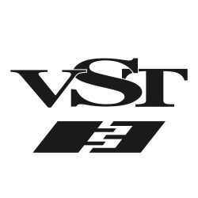

<!------>

## VST Home

---

### Welcome to the world of VST 3

This part of the [Steinberg Developer Resource](https://developer.steinberg.help/display/SDH/Steinberg+Developer+Resource) is a portal dedicated to
developers of **VST 3** plug-ins and **VST 3** hosts. Almost everything you need
for developing **VST 3** plug-ins is explained in the sections below.

### [What is VST?](../pages/What+is+VST/index.md)

Virtual Studio Technology (**VST**) is an audio plug-in software interface
that facilitates the integration of software synthesizers and effects in digital
audio workstations (DAW).

* [Use cases](../pages/What+is+VST/Use+cases.md)

### [Main benefits of VST 3](../pages/Main+benefits+of+VST+3/index.md)

Here, you can find a non-exhaustive list of **VST 3** benefits.

### [What is the VST 3 SDK?](../pages/What+is+the+VST+3+SDK/index.md)

The **VST 3 SDK** (Virtual Studio Technology Software Development Kit) is a
collection of software development tools included in one package. This
allows plug-in developers to create plug-ins in **VST 3** format and host
developers to load **VST 3** plug-ins into a DAW or audio editor.

### [VST 3 licensing](../pages/VST+3+Licensing/index.md)
- [Steinberg VST usage guidelines](../pages/VST+3+Licensing/Usage+guidelines.md)
- [What are the licensing options](../pages/VST+3+Licensing/What+are+the+licensing+options.md)
- [Which files fall under which license?](../pages/VST+3+Licensing/Which+files+fall+under+which+license.md)
- [Developer use cases (FAQs)](../pages/VST+3+Licensing/Developer+use+cases.md)

### [Getting Started](../pages/Getting+Started/Index.md)
- [VST 3 Links](pages/Getting+Started/Links.md)  — Important links you will need for working with VST 3
- [How to setup up my system for VST 3](pages/Getting+Started/How+to+setup+my+system.md) — In order to build VST 3 plug-ins, you need the source code of the VST 3 (interface definition), an IDE/compiler, cmake and a VST 3 host application. 
- [Preparation on Windows](pages/Getting+Started/Preparation+on+Windows.md)  — Generated VST3 Microsoft Visual Studio Projects using the cmake https://cmake.org/ included in the SDK will create by default symbolic links for each built plug-in in the official VST3 folder, in order to allow this on Windows you have to adapt the Group Policy of Windows. See Here!

### [Tutorials](../pages/Tutorials/Index.md)
- [Building the examples included in the SDK](../pages/Tutorials/Building+the+examples+included+in+the+SDK.md)
- [Using cmake for building VST 3 plug-ins](../pages/Tutorials/Using+cmake+for+building+plug-ins.md)
- [Generate a new plug-in with the Project Generator App](../pages/Tutorials/Generate+new+plug-in+with+Project+Generator.md)
- [Use VSTGUI to design a User Interface](../pages/Tutorials/Use+VSTGUI+to+design+a+UI.md)
- [Advanced VST 3 techniques](../pages/Tutorials/Advanced+VST+3+techniques.md)
- [How to use the silence flags](../pages/Tutorials/How+to+use+the+silence+flags.md)
- [Strings Conversion Helper](../pages/Tutorials/Strings+Conversion+Helper.md)
- [Creating a plug-in from the Helloworld template](../pages/Tutorials/Creating+a+plug-in+from+the+Helloworld+template.md)

### [VST 3 Forum](../pages/Forum/Index.md)
Visit Steinberg's **VST Developer Forum** in order to get help with development, to submit bug reports, to request new features and to connect to other **VST 3** developers:

### [Technical Documentation](../pages/Technical+Documentation/Index.md)
Browse the **VST 3 SDK**'s technical documentation. The full **VST 3 API** reference is only available in the [VST 3 Package]((pages/Getting+Started/Links.md)) that you can download or find online here.

### [Miscellaneous](../pages/Miscellaneous/Index.md)
Copyrights and Glossary