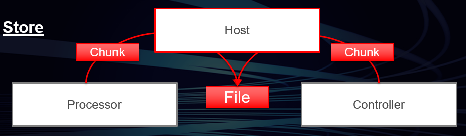
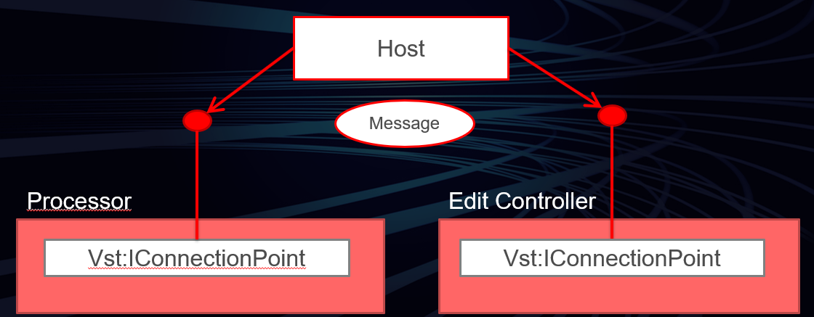

>/ [VST Home](../../) / [Technical Documentation](../Index.md)
>
># VST 3 API Documentation

**On this page:**

[[_TOC_]]

**Related pages:**

- [VST Module Architecture](../VST+Module+Architecture/Index.md)

---

The **VST 3 API** is an interface collection designed for realtime audio processing components. Such a component can be an audio effect or an audio instrument.
**VST 3** is based on a technology called [VST Module Architecture](../VST+Module+Architecture/Index.md) (**VST-MA**). Please read the [VST-MA documentation](../VST+Module+Architecture/Index.md) to find out more about how the plug-in system works in general.
The API files belonging to **VST 3** are located in the folder *"pluginterfaces/vst"*.

## Basic Concept

A **VST 3** audio effect or instrument basically consists of two parts: a processing part and an edit controller part.
The corresponding interfaces are:

- Processor : [Steinberg::Vst::IAudioProcessor](https://steinbergmedia.github.io/vst3_doc/vstinterfaces/classSteinberg_1_1Vst_1_1IAudioProcessor.html) + [Steinberg::Vst::IComponent](https://steinbergmedia.github.io/vst3_doc/vstinterfaces/classSteinberg_1_1Vst_1_1IComponent.html)
- Controller : [Steinberg::Vst::IEditController](https://steinbergmedia.github.io/vst3_doc/vstinterfaces/classSteinberg_1_1Vst_1_1IEditController.html)


The design of **VST 3** suggests a complete separation of processor and edit controller by implementing two components. Splitting up an effect into these two parts requires some extra implementation efforts.
However, this separation enables the host to run each component in a different context, even on different computers. Another benefit is that parameter changes can be separated when it comes to automation. While for processing these changes need to be transmitted in a sample-accurate way, the GUI part can be updated with a much lower frequency and it can be shifted by the amount that results from any delay compensation or other processing offset.
A plug-in that supports this separation has to set the [Steinberg::Vst::kDistributable](https://steinbergmedia.github.io/vst3_doc/vstinterfaces/namespaceSteinberg_1_1Vst.html#a626a070dcd2e025250f41b9c3f9817cda3185111648c1599241528f1a7f523396) flag in the class info of the processor component ([Steinberg::PClassInfo2::classFlags](https://steinbergmedia.github.io/vst3_doc/base/structSteinberg_1_1PClassInfo2.html#ab5ab9135185421caad5ad8ae1d758409)). Of course not every plug-in can support this, for example if it depends deeply on resources that cannot be moved easily to another computer. So when this flag is not set, the host must not try to separate the components in any way.
Although it is not recommended, it is possible to implement both the processing part and the controller part in one component class. The host tries to query the  [Steinberg::Vst::IEditController](https://steinbergmedia.github.io/vst3_doc/vstinterfaces/classSteinberg_1_1Vst_1_1IEditController.html) interface after creating an [Steinberg::Vst::IAudioProcessor](https://steinbergmedia.github.io/vst3_doc/vstinterfaces/classSteinberg_1_1Vst_1_1IAudioProcessor.html) and on success uses it as the controller.

>ⓘ **Note**\
>A host does not need to instantiate the controller part of a plug-in for processing it.
>
>The plug-in should be prepared for processing without having the controller part instantiated.

### Initialization

Both [Steinberg::Vst::IComponent](https://steinbergmedia.github.io/vst3_doc/vstinterfaces/classSteinberg_1_1Vst_1_1IComponent.html) and [Steinberg::Vst::IEditController](https://steinbergmedia.github.io/vst3_doc/vstinterfaces/classSteinberg_1_1Vst_1_1IEditController.html) derive from [Steinberg::IPluginBase](https://steinbergmedia.github.io/vst3_doc/base/classSteinberg_1_1IPluginBase.html). The purpose of this basic interface is to initialize the component and to terminate it before it is destroyed.


The context parameter passed to [Steinberg::IPluginBase::initialize](https://steinbergmedia.github.io/vst3_doc/base/classSteinberg_1_1IPluginBase.html#a3c81be4ff2e7bbb541d3527264f26eed) should implement the interface [Steinberg::Vst::IHostApplication](https://steinbergmedia.github.io/vst3_doc/vstinterfaces/classSteinberg_1_1Vst_1_1IHostApplication.html). Hosts should not call other functions before initialize is called, with the sole exception of [Steinberg::Vst::IComponent::setIoMode](https://steinbergmedia.github.io/vst3_doc/vstinterfaces/classSteinberg_1_1Vst_1_1IComponent.html#a4618e7358890d549f990010bea4a4137) which must be called before initialize. [Steinberg::Vst::IComponent::getControllerClassId](https://steinbergmedia.github.io/vst3_doc/vstinterfaces/classSteinberg_1_1Vst_1_1IComponent.html#a8aa65685068ad033af57b1497926b689) can also be called before ([See VST 3 Workflow Diagrams](../Workflow+Diagrams/Index.md)).

**How can the plug-in access IHostApplication?**

``` c++
//-----------------------------------------------------------------------
tresult PLUGIN_API MyPluginProcessor::initialize (FUnknown*context)
{
    FUnknownPtr<IHostApplication> hostApp (hostContext);
    if (hostApp)
    {
        String128 name;
        if (hostApp->getName (name) == kResultTrue)
        {
            //...
        }
    }
    //...
}
//-----------------------------------------------------------------------
```

### Creation and initialization from Host point of view

Here an example of a host implementation creating the component and its associated controller of a plug-in with a given classID:

``` c++
//-----------------------------------------------------------------------
Vst::IComponent* processorComponent;
Vst::IEditController* editController;
IPluginFactory* factory;
// ...
// factory already initialized (after the library is loaded,see validator for example)
// ...
// create its component part
tresult result = factory->createInstance (classID,Vst::IComponent::iid, (void**)&processorComponent);
if (processorComponent && (result == kResultOk))
{
    // initialize the component with our host context (note: initialize called just after creatInstance)
    res = (processorComponent->initialize (gStandardPluginContext) == kResultOk);

    // try to create the controller part from the component
    // for Plug-ins which did not succeed to separate component from controller :-(
    if (processorComponent->queryInterface (Vst::IEditController::iid, (void**)&editController) != kResultTrue)
    {
        // editController is now created, we have the ownership, which means that we have
        // to release it when not used anymore FUID controllerCID;

        // ask for the associated controller class ID (could be called before processorComponent->initialize ())
        if (processorComponent->getControllerClassId (controllerCID) == kResultTrue && controllerCID.isValid ())
        {
            // create its controller part created from the factory
            result = factory->createInstance (controllerCID, Vst::IEditController::iid, (void**)&editController);
            if (editController && (result == kResultOk))
            {
                // initialize the component with our context
                res = (editController->initialize (gStandardPluginContext) == kResultOk);

                // now processorComponent and editController are initialized... :-)
            }
        }
    }
}
//-----------------------------------------------------------------------
```

>ⓘ **Note**\
>Please be aware that IPluginBase::initialize and IPluginBase::terminate must only be called once per object instance. So if an object implements both IAudioProcessor and IEditController take care to only call them once as in the example above.

### Extensions

The functionality of the components implementing these basic interfaces can be extended by a number of optional interfaces that only need to be implemented if this extension is required.

- Processor Extensions:
  - [Steinberg::Vst::IConnectionPoint](https://steinbergmedia.github.io/vst3_doc/vstinterfaces/classSteinberg_1_1Vst_1_1IConnectionPoint.html)
  - [Steinberg::Vst::IUnitData](https://steinbergmedia.github.io/vst3_doc/vstinterfaces/classSteinberg_1_1Vst_1_1IUnitData.html)
  - [Steinberg::Vst::IProgramListData](https://steinbergmedia.github.io/vst3_doc/vstinterfaces/classSteinberg_1_1Vst_1_1IProgramListData.html)
- Edit Controller Extensions:
  - [Steinberg::Vst::IConnectionPoint](https://steinbergmedia.github.io/vst3_doc/vstinterfaces/classSteinberg_1_1Vst_1_1IConnectionPoint.html)
  - [Steinberg::Vst::IMidiMapping](https://steinbergmedia.github.io/vst3_doc/vstinterfaces/classSteinberg_1_1Vst_1_1IMidiMapping.html)
  - [Steinberg::Vst::IUnitInfo](https://steinbergmedia.github.io/vst3_doc/vstinterfaces/classSteinberg_1_1Vst_1_1IUnitInfo.html)

### Persistence

The host stores and restores the complete state of the processor and of the controller in project files and in preset files:

- [Steinberg::Vst::IComponent::getState](https://steinbergmedia.github.io/vst3_doc/vstinterfaces/classSteinberg_1_1Vst_1_1IComponent.html#a10db03106be8ba89d23859fa6be5d9f6) + [Steinberg::Vst::IComponent::setState](https://steinbergmedia.github.io/vst3_doc/vstinterfaces/classSteinberg_1_1Vst_1_1IComponent.html#a77ac39bcc5c4b15818b1a87de2573805)
store and restore the DSP model.
- [Steinberg::Vst::IEditController::getState](https://steinbergmedia.github.io/vst3_doc/vstinterfaces/classSteinberg_1_1Vst_1_1IEditController.html#a10db03106be8ba89d23859fa6be5d9f6) + [Steinberg::Vst::IEditController::setState](https://steinbergmedia.github.io/vst3_doc/vstinterfaces/classSteinberg_1_1Vst_1_1IEditController.html#a77ac39bcc5c4b15818b1a87de2573805)
store and restore any GUI settings that are not related to the processor (like scroll positions etc).
- **Restore**: When the states are restored, the host passes the processor state to both the processor and the controller ([Steinberg::Vst::IEditController::setComponentState](https://steinbergmedia.github.io/vst3_doc/vstinterfaces/classSteinberg_1_1Vst_1_1IEditController.html#a4c2e1cafd88143fda2767a9c7ba5d48f)). A host must always pass that state to the processor first. The controller then has to synchronize its parameters to this state (but must not perform any [IComponentHandler](https://steinbergmedia.github.io/vst3_doc/vstinterfaces/classSteinberg_1_1Vst_1_1IComponentHandler.html) callbacks).
After restoring a state, the host rescans the parameters (asking the controller) in order to update its internal representation.




See also

- [Steinberg::IBStream](https://steinbergmedia.github.io/vst3_doc/base/classSteinberg_1_1IBStream.html)
- [VST 3 Interfaces to be implemented by the Plug-in](../Change+History/3.0.0/Plug+in+Interfaces.md)
- [VST 3 Interfaces to be implemented by the Host](../Change+History/3.0.0/Host+Interfaces.md)

## The Processing Part


The processing part consists of two related interfaces: [Steinberg::Vst::IComponent](https://steinbergmedia.github.io/vst3_doc/vstinterfaces/classSteinberg_1_1Vst_1_1IComponent.html) and [Steinberg::Vst::IAudioProcessor](https://steinbergmedia.github.io/vst3_doc/vstinterfaces/classSteinberg_1_1Vst_1_1IAudioProcessor.html). The reason for splitting the two is to use the basic interfaces [Steinberg::Vst::IComponent](https://steinbergmedia.github.io/vst3_doc/vstinterfaces/classSteinberg_1_1Vst_1_1IComponent.html) not only for audio plug-ins but also for other kinds of media (e.g. video processing in the future). Hence the [Steinberg::Vst::IAudioProcessor](https://steinbergmedia.github.io/vst3_doc/vstinterfaces/classSteinberg_1_1Vst_1_1IAudioProcessor.html) interface represents the audio-specific part of a processing component. Let's have a closer look at the concepts.

### IComponent

The [Steinberg::Vst::IComponent](https://steinbergmedia.github.io/vst3_doc/vstinterfaces/classSteinberg_1_1Vst_1_1IComponent.html) interface allows the host to get information about the plug-in:

1. **Edit controller association**: In order to enable the host to create the associated edit controller part, the processing component has to provide the matching class-ID. The host uses the module's class factory to create the controller component. See [Steinberg::Vst::IComponent::getControllerClassId](https://steinbergmedia.github.io/vst3_doc/vstinterfaces/classSteinberg_1_1Vst_1_1IComponent.html#a8aa65685068ad033af57b1497926b689)

2. The host can ask for bus configurations ([Steinberg::Vst::BusInfo](https://steinbergmedia.github.io/vst3_doc/vstinterfaces/structSteinberg_1_1Vst_1_1BusInfo.html)). See [Steinberg::Vst::IComponent::getBusInfo](https://steinbergmedia.github.io/vst3_doc/vstinterfaces/classSteinberg_1_1Vst_1_1IComponent.html#a41b0e971a0ff153a4eb34274750b0c91)

3. The host can ask for routing information ([Steinberg::Vst::RoutingInfo](https://steinbergmedia.github.io/vst3_doc/vstinterfaces/structSteinberg_1_1Vst_1_1RoutingInfo.html)).

4. The host can activate or deactivate a specific bus like [side-chain](../Change+History/3.0.0/Multiple+Dynamic+IO.html#what-is-a-side-chain). A deactivated bus should be not processed by the plug-in. See [Steinberg::Vst::IComponent::activateBus](https://steinbergmedia.github.io/vst3_doc/vstinterfaces/classSteinberg_1_1Vst_1_1IComponent.html#a3ab7d06aaefe03da1fcd1819f1261050)

5. The host can activate or deactivate the plug-in (On/Off button). See [Steinberg::Vst::IComponent::setActive](https://steinbergmedia.github.io/vst3_doc/vstinterfaces/classSteinberg_1_1Vst_1_1IComponent.html#a0a840e8077eb74ec429b8007c7b83517)

6. The host can store and restore the state of the plug-in (preset and project persistence). See [Steinberg::Vst::IComponent::getState](https://steinbergmedia.github.io/vst3_doc/vstsdk/classSteinberg_1_1Vst_1_1Component.html#aee393393dc4dccf6e0b30a43380859b4),  [Steinberg::Vst::IComponent::setState](https://steinbergmedia.github.io/vst3_doc/vstsdk/classSteinberg_1_1Vst_1_1Component.html#a9228db732b48ece8b5b734e69b979d10)

### IAudioProcessor

The [Steinberg::Vst::IAudioProcessor](https://steinbergmedia.github.io/vst3_doc/vstinterfaces/classSteinberg_1_1Vst_1_1IAudioProcessor.html) interface extends [Steinberg::Vst::IComponent](https://steinbergmedia.github.io/vst3_doc/vstinterfaces/classSteinberg_1_1Vst_1_1IComponent.html) by providing a state machine for processing and the process method:

1. **Setup**: The processor must be configured before processing can start. Configurations are only allowed when the processor is inactive ([Steinberg::Vst::IComponent::setActive](https://steinbergmedia.github.io/vst3_doc/vstinterfaces/classSteinberg_1_1Vst_1_1IComponent.html#a0a840e8077eb74ec429b8007c7b83517)).
   - **Process setup**: The processor is informed about the parameters that cannot be changed while processing is active. ([Steinberg::Vst::ProcessSetup](https://steinbergmedia.github.io/vst3_doc/vstinterfaces/structSteinberg_1_1Vst_1_1ProcessSetup.html)).
   - **Dynamic Speaker Arrangements**: The host can try to change the number of channels of an audio bus. By default the speaker arrangement is defined by the plug-in. In order to adjust the plug-in to a context where a different speaker arrangement is used, the host can try to change it using [Steinberg::Vst::IAudioProcessor::setBusArrangements](https://steinbergmedia.github.io/vst3_doc/vstinterfaces/classSteinberg_1_1Vst_1_1IAudioProcessor.html#ad3bc7bac3fd3b194122669be2a1ecc42)
2. When the processor is configured, it has to be activated ([Steinberg::Vst::IComponent::setActive](https://steinbergmedia.github.io/vst3_doc/vstinterfaces/classSteinberg_1_1Vst_1_1IComponent.html#a0a840e8077eb74ec429b8007c7b83517)). The activation call signals that all configurations have been finished.
3. In addition to that, the processor has a 'processing state'. Before a host begins to perform processing calls, it has to signal this by calling [IAudioProcessor::setProcessing](https://steinbergmedia.github.io/vst3_doc/vstinterfaces/classSteinberg_1_1Vst_1_1IAudioProcessor.html#af252fd721b195b793f3a5dfffc069401) (true). When the host stops processing, it must call [IAudioProcessor::setProcessing](https://steinbergmedia.github.io/vst3_doc/vstinterfaces/classSteinberg_1_1Vst_1_1IAudioProcessor.html#af252fd721b195b793f3a5dfffc069401) (false) after the last processing call. Please see also: [VST 3 Workflow Diagrams](../Workflow+Diagrams/Index.md)
4. **Process**: [Steinberg::Vst::IAudioProcessor::process](https://steinbergmedia.github.io/vst3_doc/vstinterfaces/classSteinberg_1_1Vst_1_1IAudioProcessor.html#a6b98eb31cf38ba96a28b303c13c64e13) is the method that implements the actual processing. Any data needed for processing is passed to it as a parameter [Steinberg::Vst::ProcessData](https://steinbergmedia.github.io/vst3_doc/vstinterfaces/structSteinberg_1_1Vst_1_1ProcessData.html#a100f97803b72565daedee80e34bbb7f0). This is necessary because processing is often performed in a separate thread and this is a simple way to avoid thread synchronization problems.
   - **Block Size**: Processing is done in blocks. The maximum number of samples to be processed in one block is set in [Steinberg::Vst::IAudioProcessor::setupProcessing](https://steinbergmedia.github.io/vst3_doc/vstinterfaces/classSteinberg_1_1Vst_1_1IAudioProcessor.html#aefb5731b94dbc899a4a7e9cd1c96e6a2). The actual number of samples in a processing block is transmitted in the process call and can be different from call to call, but it must be a value between 1 and [maxSamplesPerBlock](https://steinbergmedia.github.io/vst3_doc/vstinterfaces/structSteinberg_1_1Vst_1_1ProcessSetup.html#a41cd06a0c942a1b3f283092b893d0de3).

   - **Audio Buffers**: For any audio bus defined by the plug-in, the host must provide buffer data - even for inactive busses. Busses are addressed by index, so leaving out inactive busses will mix up these indices. The actual data buffer can be null though (see [Steinberg::Vst::AudioBusBuffers](https://steinbergmedia.github.io/vst3_doc/vstinterfaces/structSteinberg_1_1Vst_1_1AudioBusBuffers.html)).</br>
   **Note**: The [channelBuffers32](https://steinbergmedia.github.io/vst3_doc/vstinterfaces/structSteinberg_1_1Vst_1_1AudioBusBuffers.html#abac2239417d88a091cad5b4f917dc49a) (or [channelBuffers64](https://steinbergmedia.github.io/vst3_doc/vstinterfaces/structSteinberg_1_1Vst_1_1AudioBusBuffers.html#a0bbcd9a3e75d01b547097c91f9f659cf)) buffer pointers can be the same or different for input and output: this has to be taken into account in the process function (for example not resetting the output before processing if input and output buffers are the same!). It can be the same for multiple inputs or multiple outputs (in the case of instrument plug-ins) all outputs (or inputs) can share the same buffer!</br>
   **Important**: The host can call [Steinberg::Vst::IAudioProcessor::process](https://steinbergmedia.github.io/vst3_doc/vstinterfaces/classSteinberg_1_1Vst_1_1IAudioProcessor.html#a6b98eb31cf38ba96a28b303c13c64e13) without buffers ([numInputs](https://steinbergmedia.github.io/vst3_doc/vstinterfaces/structSteinberg_1_1Vst_1_1ProcessData.html#a852a74fc4e461ef086bac048313d2de9) and [numOutputs](https://steinbergmedia.github.io/vst3_doc/vstinterfaces/structSteinberg_1_1Vst_1_1ProcessData.html#a1338255f88bad5cf4fb714c71f92b61a) of [Steinberg::Vst::AudioBusBuffers](https://steinbergmedia.github.io/vst3_doc/vstinterfaces/structSteinberg_1_1Vst_1_1AudioBusBuffers.html) are zeroed, [numSamples](https://steinbergmedia.github.io/vst3_doc/vstinterfaces/structSteinberg_1_1Vst_1_1ProcessData.html#aeb42971a4bd34d7baa27cff8d7e3cf26) too), in order to flush parameters (from host to plug-in). Parameters can only be flushed when the host needs to send parameter changes and no processing is called.
   - **Parameters & Automation**: Any parameter changes are transmitted in the process call through the interfaces [Steinberg::Vst::IParameterChanges](https://steinbergmedia.github.io/vst3_doc/vstinterfaces/classSteinberg_1_1Vst_1_1IParameterChanges.html) and [Steinberg::Vst::IParamValueQueue](https://steinbergmedia.github.io/vst3_doc/vstinterfaces/classSteinberg_1_1Vst_1_1IParamValueQueue.html). Simple parameter changes as a result of GUI interaction are transmitted exactly in the same way as automation. (see [Parameters and Automation](../Parameters+Automation/Index.md)).
   - **Context**: For each processing block the host should provide information about its state. See [Steinberg::Vst::ProcessContext](https://steinbergmedia.github.io/vst3_doc/vstinterfaces/structSteinberg_1_1Vst_1_1ProcessContext.html)
   - **Events**: [Steinberg::Vst::IEventList](https://steinbergmedia.github.io/vst3_doc/vstinterfaces/classSteinberg_1_1Vst_1_1IEventList.html)


## The Editing Part


The edit controller is responsible for the GUI aspects ofthe plug-in. Its standard interface is [Steinberg::Vst::IEditController](https://steinbergmedia.github.io/vst3_doc/vstinterfaces/classSteinberg_1_1Vst_1_1IEditController.html). The host has to provide acallback interface for the edit controller named [Steinberg::Vst::IComponentHandler](https://steinbergmedia.github.io/vst3_doc/vstinterfaces/classSteinberg_1_1Vst_1_1IComponentHandler.html). The handler is essentialfor the communication with both the host and the processor.

- **GUI**: Optionally, the controller can define an editor view. The method [Steinberg::Vst::IEditController::createView](https://steinbergmedia.github.io/vst3_doc/vstinterfaces/classSteinberg_1_1Vst_1_1IEditController.html#a1fa4ed10cc0979e5559045104c998b1a) allows the host to specify the type of the view by passing an id-string. Currently the only type defined is "editor" ([Steinberg::Vst::ViewType::kEditor](https://steinbergmedia.github.io/vst3_doc/vstinterfaces/namespaceSteinberg_1_1Vst_1_1ViewType.html#aaa62c4c32f0270a908eb20c7c7124dfc)), but there might be variations in future versions (e.g. "setup").
See also [Steinberg::IPlugView](https://steinbergmedia.github.io/vst3_doc/base/classSteinberg_1_1IPlugView.html).

- **Parameters**: The controller is responsible for the management of parameters. Any change to a parameter that is caused by user interaction in the plug-in GUI must be properly reported to the [Steinberg::Vst::IComponentHandler](https://steinbergmedia.github.io/vst3_doc/vstinterfaces/classSteinberg_1_1Vst_1_1IComponentHandler.html). The host is responsible for transmitting the change to the processor. In order to make recording of automation work, it is necessary to call [beginEdit](https://steinbergmedia.github.io/vst3_doc/vstinterfaces/classSteinberg_1_1Vst_1_1IComponentHandler.html#a8456ad739430267a12dda11a53fe9223), [performEdit](https://steinbergmedia.github.io/vst3_doc/vstinterfaces/classSteinberg_1_1Vst_1_1IComponentHandler.html#a135d4e76355ef0ba0a4162a0546d5f93) and [endEdit](https://steinbergmedia.github.io/vst3_doc/vstinterfaces/classSteinberg_1_1Vst_1_1IComponentHandler.html#ae380206486b11f000cad7c0d9b6e877c) in the expected order! And from the **UI-Thread**!
With the new interface [IComponentHandler2](https://steinbergmedia.github.io/vst3_doc/vstinterfaces/classSteinberg_1_1Vst_1_1IComponentHandler2.html) (since VST 3.1), the plug-in (from UI) can group parameters which should use the same time-stamp in host when writing automation, by wrapping a set of [beginEdit](https://steinbergmedia.github.io/vst3_doc/vstinterfaces/classSteinberg_1_1Vst_1_1IComponentHandler.html#a8456ad739430267a12dda11a53fe9223)/[performEdit](https://steinbergmedia.github.io/vst3_doc/vstinterfaces/classSteinberg_1_1Vst_1_1IComponentHandler.html#a135d4e76355ef0ba0a4162a0546d5f93)/[endEdit](https://steinbergmedia.github.io/vst3_doc/vstinterfaces/classSteinberg_1_1Vst_1_1IComponentHandler.html#ae380206486b11f000cad7c0d9b6e877c) functions (see [IComponentHandler](https://steinbergmedia.github.io/vst3_doc/vstinterfaces/classSteinberg_1_1Vst_1_1IComponentHandler.html)) with [startGroupEdit](https://steinbergmedia.github.io/vst3_doc/vstinterfaces/classSteinberg_1_1Vst_1_1IComponentHandler2.html#aba339113df404a6b3c557774d4aa9102) and [finishGroupEdit](https://steinbergmedia.github.io/vst3_doc/vstinterfaces/classSteinberg_1_1Vst_1_1IComponentHandler2.html#adbdc10ff7ecd96fa365ad4f98d57b55e).
More details can be found on the page about [Parameters](../Parameters+Automation/Index.md).

- **Plug-in structure**: If the plug-in is composed of discrete functional parts, the edit controller should publish this structure and the parameters belonging to each part by implementing the [Steinberg::Vst::IUnitInfo](https://steinbergmedia.github.io/vst3_doc/vstinterfaces/classSteinberg_1_1Vst_1_1IUnitInfo.html) interface. More details can be found on the page about [VST 3 Units](../VST+3+Units/Index.html).


## VST 3 threading model

The threading model used by **VST 3** is quite simple and requires that:

- all initialisation/de-initialisation are done in the UI Thread
- all function exported by the plugin-in are called by the host in the UI Thread with the exception of:
  - IAudioProcessor→process: which could be called in a Audio Thread (realtime thread), avoid any memory allocation!
  - IAudioProcessor→setProcessing: which could be called in a Audio Thread (realtime thread), avoid any memory allocation!
- all function exported by the host are called by the plug-in in the UI Thread

Check the [Audio Processor Call Sequence](../Workflow+Diagrams/Audio+Processor+Call+Sequence.md) and the [Edit Controller Call Sequence](../Workflow+Diagrams/Edit+Controller+Call+Sequence.md)

## Communication between the components

The two **VST 3** components (processor and controller) need a way to communicate. It is the task of the host to handle this.

### Standard communication

All standard data (like parameter changes) are transmitted between processor and controller using the basic interfaces listed above.

- After creation of processor and controller, the host sets the controller component state from the processors state. This is a change from the previous SDK, where it was assumed that after creation the controller and the processor are in sync.
- When the host sets a new processor state ([Steinberg::Vst::IComponent::setState](https://steinbergmedia.github.io/vst3_doc/vstinterfaces/classSteinberg_1_1Vst_1_1IComponent.html#a77ac39bcc5c4b15818b1a87de2573805)), this state is always transmitted to the controller as well ([Steinberg::Vst::IEditController::setComponentState](https://steinbergmedia.github.io/vst3_doc/vstinterfaces/classSteinberg_1_1Vst_1_1IEditController.html#a4c2e1cafd88143fda2767a9c7ba5d48f)). The controller then has to synchronize to this state and adjust its parameters.
- When the controller transmits a parameter change to the host, the host synchronizes the processor by passing the new values as [Steinberg::Vst::IParameterChanges](https://steinbergmedia.github.io/vst3_doc/vstinterfaces/classSteinberg_1_1Vst_1_1IParameterChanges.html) to the process call.
- The processor can transmit outgoing parameter changes to the host as well. ([Steinberg::Vst::ProcessData::outputParameterChanges](https://steinbergmedia.github.io/vst3_doc/vstinterfaces/structSteinberg_1_1Vst_1_1ProcessData.html#af08c4f7dfd9e456cc98ba0eb325993ae)). These are transmitted to the edit controller by the call of [Steinberg::Vst::IEditController::setParamNormalized](https://steinbergmedia.github.io/vst3_doc/vstinterfaces/classSteinberg_1_1Vst_1_1IEditController.html#aded549c5b0f342a23dee18cc41ece6b8).


### Private communication

Data that is unknown to the host can be transmitted by means of messages. The communication interfaces are

- [Steinberg::Vst::IConnectionPoint](https://steinbergmedia.github.io/vst3_doc/vstinterfaces/classSteinberg_1_1Vst_1_1IConnectionPoint.html): The host establishes a connection between processor and controller.
- [Steinberg::Vst::IMessage](https://steinbergmedia.github.io/vst3_doc/vstinterfaces/classSteinberg_1_1Vst_1_1IMessage.html): Represents a message to send to the counterpart.
- [Steinberg::Vst::IAttributeList](https://steinbergmedia.github.io/vst3_doc/vstinterfaces/classSteinberg_1_1Vst_1_1IAttributeList.html): A list of attributes belonging to a message.

Please note that messages from the processor to the controller must not be sent during the process call, as this would not be fast enough and would break the real time processing. Such tasks should be handled in a separate timer thread.



### Initialization of communication from Host point of view

Here an example of host implementation where the component and controller parts are connected and synchronized:

``` c++
//-----------------------------------------------------------------------
// the component and the controller parts are previously becreated and initialized (see above)
// ...
if (editController)
{
    // set the host handler
    // the host set its handler to the controller
    editController->setComponentHandler (myHostComponentHandler);

    // connect the 2 components
    Vst::IConnectionPoint* iConnectionPointComponent = nullPtr;
    Vst::IConnectionPoint* iConnectionPointController = nullPtr;

    processorComponent->queryInterface (Vst::IConnectionPoint::iid, (void**)&iConnectionPointComponent);
    editController->queryInterface (Vst::IConnectionPoint::iid, (void**)&iConnectionPointController);

    if (iConnectionPointComponent && iConnectionPointController)
    {
        iConnectionPointComponent->connect (iConnectionPointController);
        iConnectionPointController->connect (iConnectionPointComponent);
    }

    // synchronize controller to component by using setComponentState
    MemoryStream stream; // defined in "public.sdk/source/common/memorystream.h"
    stream.setByteOrder (kLittleEndian);
    if (processorComponent->getState (&stream) == kResultTrue)
    {
        stream.rewind ();
        editController->setComponentState (&stream);
    }

    // now processorComponent and editController parts are connected and synchronized...:-)
}
```

>ⓘ **Note**\
>Please note that you CANNOT rely on the implementation detail that the connection is done directly between the processor component and the edit controller!
