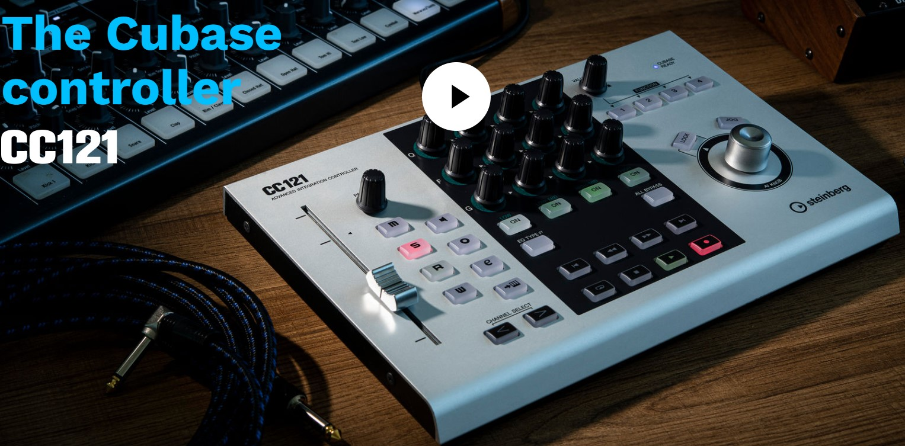
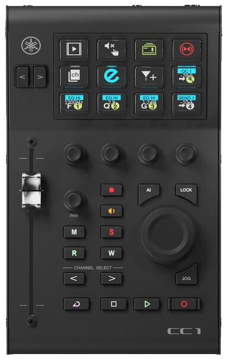

>/ [VST Home](../../../) / [Technical Documentation](../../Index.md)
>
># \[3.0.2\] Parameter Finder

**On this page:**

[[_TOC_]]

---

## Introduction

How the host can retrieve the parameter where the mouse cursor is located.Extension for [Steinberg:: IPlugView](https://steinbergmedia.github.io/vst3_doc/base/classSteinberg_1_1IPlugView.html) to find view parameters (lookup value under mouse support): [Vst:: IParameterFinder](https://steinbergmedia.github.io/vst3_doc/vstinterfaces/classSteinberg_1_1Vst_1_1IParameterFinder.html).

- \[plug imp\]
- [extends [Steinberg:: IPlugView](https://steinbergmedia.github.io/vst3_doc/base/classSteinberg_1_1IPlugView.html)]
- \[released: 3.0.2\]
- \[optional\]

It is highly recommended to implement this interface. A host can implement important functionality when a plug-in supports this interface.

## Some Examples

For example, all Steinberg hosts require this interface in order to support the **AI Knob**.

### CC121

### CC1

