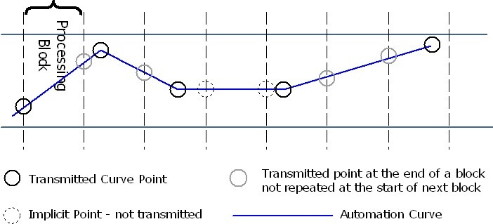

>/ [VST Home](../../Index.md) / [Technical Documentation](../Index.md)
>
># Parameters and Automation

**On this page:**

[[_TOC_]]

**Related pages:**

- [VST 3 Units](../VST+3+Units/Index.md)

---

Description of how parameters are defined and used in **VST 3**

## Parameters

A plug-in requires parameters in order to control its DSP algorithm, for example, a Frequency parameter for a filter. The plug-in can export these parameters in order to make them visible to the host and allow the host to control/change/automate/remote/visualize them. Some parameters can be defined for private use only (not visible to the user) or as read-only, such as parameters associated to VU Meters.

[Steinberg::Vst::IEditController::getParameterCount](https://steinbergmedia.github.io/vst3_doc/vstinterfaces/classSteinberg_1_1Vst_1_1IEditController.html#ab6ffbb8e3bf6f4829ab1c9c23fe935a1) allows the host to to identify the number of parameters that are exported by the plug-in.
The plug-in must assign a unique 32-bit identifier (ID) to each exported parameter.

>Up to 2^31 parameters can be exported with ID range **[0, 2147483648]** (the range [2147483649, 429496729] is reserved for host application).

Please note that it is not allowed to change this assignment at any time. In particular, a plug-in must not perform any reconfigurations that lead to a different set of automatable parameters. The only allowed variation is the adding or removing of parameters in a future plug-in version. However, keep in mind that automation data can get lost when parameters are removed.

Usually, the host is unaware of a parameter's semantics. However, there are a few important exceptions that the controller must announce using the [Steinberg::Vst::ParameterInfo::flags](https://steinbergmedia.github.io/vst3_doc/vstinterfaces/structSteinberg_1_1Vst_1_1ParameterInfo.html#a8ffba1d4311e48ae488bc118f20d7edb):

- **kCanAutomate**: This means that this parameter can be automated by the host using its automation track. **[SDK 3.0.0]**

- **kIsBypass**: If the plug-in performs bypass processing itself, it must export the corresponding parameter and flag it with kIsBypass. It is highly recommended that this bypass parameter is provided by the effect plug-in. If the plug-in does not export a bypass parameter, the host can perform bypass processing and the plug-in process call will be discontinued. Only one bypass parameter is allowed. The plug-in should save the state of this bypass parameter like other parameters (when getState and setState are used). If the plug-in does not need a bypass (like Instrument) this flag should be not used. Check this [FAQ](../../FAQ/Index.md) in order to understand how bypass processing works. **[SDK 3.0.0]**

- **kIsReadOnly**: This means that this parameter cannot be changed from outside the plug-in, this requires that kCanAutomate is NOT set. **[SDK 3.0.0]**

- **kIsWrapAround**: When a UI control created by the host for this parameter attempts to set its value out of the limits, this UI control will make a wrap around (useful for parameters like 360 degree rotation). **[SDK 3.0.2]**

- **kIsList**: This means that the host will display this parameter as list in a generic editor or automation editing. **[SDK 3.1.0]**

- **kIsHidden**: This means that this parameter will NOT be displayed and cannot be changed from outside the plug-in. This requires that kCanAutomate is NOT set and kIsReadOnly is set. **[SDK 3.7.0]**

- **kIsProgramChange**: If the plug-in supports program lists (see [VST 3 Units](../VST+3+Units/Index.md), [Program Lists](../Presets+Program+Lists/Index.md)), each 'unit' of the plug-in needs to export a program selector parameter. Such a parameter is not allowed to be automated when the affected parameters are flagged as automatable as well. A host can display program parameters at dedicated locations of its GUI. **[SDK 3.0.0]**

The controller must support the conversion to a string for any exported parameter. The conversion method [Steinberg::Vst::IEditController::getParamStringByValue](https://steinbergmedia.github.io/vst3_doc/vstinterfaces/classSteinberg_1_1Vst_1_1IEditController.html#aab2f0b853e75361d331b667e7893962e) must provide a result for any possible normalized parameter value.

>⚠️ **Warning**<br>
>Parameter values are always transmitted in a normalized floating point (64bit double) representation **[0.0, 1.0]**.

### Representation of parameter values

A plug-in parameter usually has more than one representation. The GUI of a plug-in can display something that appears to be a single parameter, but might control multiple processing parameters at the same time. Or the GUI representation displays a scale-transformed representation of a DSP-Parameter.

Somewhere on the way from the GUI to the DSP algorithm, this transformation has to be performed. The host does not need information about DSP parameters, but it is responsible for reporting parameter changes to the processor. According to this, the processor is the only place where a transformation can happen and all parameters always have to match the GUI representation.

Does this fit into the idea of separating GUI and processing? No problem so far

- it is a separation of duties, nothing more. The processor component and the controller component have to work on the same internal plug-in model. The controller knows how this model has to be presented in the GUI. The processor knows how the model has to be translated into DSP parameters.<br>
The **VST 3** interfaces suggest a normalized value representation for a part of this model (the part that is exported as parameters). This means every value has to be inside the range from 0.0 to 1.0.

#### Parameter styles / 'Step Count'

Although values are transmitted in a normalized format, the host needs to know some details of the parameter's displayed GUI representation. When editing automation data, for example, the host must know the nature of a parameter expressed in its 'step count' (see [Steinberg::Vst::ParameterInfo::stepCount](https://steinbergmedia.github.io/vst3_doc/vstinterfaces/structSteinberg_1_1Vst_1_1ParameterInfo.html#ac1efeff62e4ba9aea101c3327e0b5c4d)).

**Step count semantics :**

- **0**: A continuous parameter. Any normalized value has an exact mapping (0 = there are no steps between the values)
- **1**: A discrete parameter with 2 states like [on/off] [yes/no] etc. (1 = there is one step between these states)
- **2**: A discrete parameter with 3 states [0,1,2] or [3,5,7] (2 = there are two steps between these states)
- **3**: etc...

### Conversion of normalized values

The controller and the processor have to work with normalized parameter values.

- Step count 0 : Continuous parameters simply need to be mapped accordingly
- Step count n : Discrete parameters need a little bit more care

    - **Discrete Value => Normalize**
        ```
        double normalized = discreteValue / (double)stepCount;
        ```

    - **Normalize => Discrete Value (Denormalize)**
        ```
        int discreteValue = min (stepCount, normalized *(stepCount + 1));
        ```

**Example**: Step Count 3


## Automation

A host that supports parameter automation is dependent on a proper cooperation of the component owning these parameters. One intention in the design of the **VST 3** interfaces was to reduce the amount of possible mistakes for an implementation. The separation of processor and controller enforces that all parameter changes have to be handled by the host in a defined way. Additionally, this allows the host to store the changes as automation data. Nevertheless, there are some more things to consider:

No automated parameter must influence another automated parameter!

The prime example for this is the automation of preset changes. A preset change can lead to the change of all 'normal' parameters. So if automation data already has been recorded for these parameters and the preset change is recorded as well: who wins? This question cannot be answered and the problem can only be resolved by avoiding it. This is why automation of preset changes is not allowed by default.

### Problems

A fix value range from 0.0 to 1.0 simplifies the handling of parameters in some ways, but there are problems:

- **Non-linear scaling**<br>
If the DSP representation of a value does not scale in a linear way to the exported normalized representation (which can happen when a decibel scale is used, for example), the edit controller must provide a conversion to a plain representation. This allows the host to move automation data (being in GUI representation) and keep the original value relations intact. ([Steinberg::Vst::IEditController::normalizedParamToPlain](https://steinbergmedia.github.io/vst3_doc/vstinterfaces/classSteinberg_1_1Vst_1_1IEditController.html#a849747dc98909312b4cdbdeea82dbae0) / [Steinberg::Vst::IEditController::plainParamToNormalized](https://steinbergmedia.github.io/vst3_doc/vstinterfaces/classSteinberg_1_1Vst_1_1IEditController.html#ae9706616ae6d938bbf102954f8f2f110)).

- **Changes in future plug-in versions**<br>
Take a discrete parameter, for example, that controls an option of three choices. If the host stores normalized values as automation data and a new version of a plug-in invented a fourth choice, the automation data will be invalid now. So either the host has to store denormalized values as automation or it must recalculate the automation data accordingly.

### Automation Recording

Automation recording is performed by the host. In doing so, it is essential for the host to know the start and the end of a manipulation. Therefore, the plug-in must operate the [Steinberg::Vst::IComponentHandler](https://steinbergmedia.github.io/vst3_doc/vstinterfaces/classSteinberg_1_1Vst_1_1IComponentHandler.html) interface in the following way and in the **UI Thread**!:

- The begin of a manipulation must be signaled via [Steinberg::Vst::IComponentHandler::beginEdit](https://steinbergmedia.github.io/vst3_doc/vstinterfaces/classSteinberg_1_1Vst_1_1IComponentHandler.html#a8456ad739430267a12dda11a53fe9223)

- Changes of parameters are reported via [Steinberg::Vst::IComponentHandler::performEdit](https://steinbergmedia.github.io/vst3_doc/vstinterfaces/classSteinberg_1_1Vst_1_1IComponentHandler.html#a135d4e76355ef0ba0a4162a0546d5f93)

- The end of a manipulation must be signaled via [Steinberg::Vst::IComponentHandler::endEdit](https://steinbergmedia.github.io/vst3_doc/vstinterfaces/classSteinberg_1_1Vst_1_1IComponentHandler.html#ae380206486b11f000cad7c0d9b6e877c)

The plug-in must stick to the order of these callbacks. Otherwise, automation recording cannot work correctly. However, the implementation can bring up difficulties. Each type of GUI control and the way it is operated along with the nature of the controlled parameter requires specific considerations.
To address the most common cases:

#### Sliders & Knobs

These kind of controls usually control continuous parameters and they are usually operated with the mouse. This common case is the most simple to handle: On mouse-click-down call beginEdit (followed by performEdit when the control allows a jump), on mouse-drag call performEdit and on mouse-click-up call endEdit.

Trouble starts with the **mouse wheel**: There simply is nothing like a defined start or end when the wheel is operated - each wheel event arrives 'out of the blue'. The only way to enable proper automation recording in this case is the usage of a timer.

- A plug-in implementation should call beginEdit when the first wheel event is handled and start a timer (followed by the first call to performEdit). Further wheel events that arrive inside of the timeout interval are reported with performEdit and the timer is restarted. When the timeout period has passed without further events, endEdit should be called and the timer can be removed.</p>
- But since it is the host's task to record automation data, one could argue that it should be the host's task to take care of the timer in this case. This is the reason for the following exception to the rule:
    - Mouse wheel events can be reported without beginEdit and endEdit to the host. The host must be prepared to receive a performEdit without a previous call of beginEdit for a parameter and handle the timeout itself.

#### Buttons / Radio Groups / Pop-up Menus

These kind of controls usually control discrete parameters and simply switch the state of something. A proper handling is to call beginEdit, performEdit and endEdit in a row. The affected parameter has to be exported to the host with the correct step count because discrete parameters are handled differently than continuous parameters in regard to automation.

Mouse wheel handling usually is not supported for buttons, but sometimes for pop-up menus. Discrete parameters do not require the usage of a timer in order to be recorded correctly.

So the plug-in should call the 3 functions in a row for each wheel event - again, the other option is to omit beginEdit and endEdit, but in this case, be sure to report the discrete nature of the parameter to the host correctly.

#### Text Input

For reporting the results of a text input value change for a continuous or a discrete parameter, always call beginEdit, performEdit and endEdit in a row.

### Automation Playback

In **VST 3**, automation playback is the task of the plug-in and it is the host's task to provide the automation data. The only way for a parameter change to arrive in the processor is the processing call. Receiving parameter changes from the edit controller and playing back automation data is one and the same thing.

The need to perform all transformations, from the normalized GUI representation to the DSP representation, produces some overhead. Performing sample accurate automation requires even more overhead, because the DSP value must be calculated for each single sample. While this cannot be avoided entirely, it is the choice of the plug-in implementation how much processing time to spend on automation accuracy. The host always transmits value changes in a way that allows a sample accurate reconstruction of the underlying automation curve. The plug-in is responsible for the realization.



The processor gets the automation data in the processing call by using queue of parameter changes for each parameter having automation data:

a [IParameterChanges](https://steinbergmedia.github.io/vst3_doc/vstinterfaces/classSteinberg_1_1Vst_1_1IParameterChanges.html) has some [IParamValueQueues](https://steinbergmedia.github.io/vst3_doc/vstinterfaces/classSteinberg_1_1Vst_1_1IParamValueQueue.html) (for a specific parameter ID) which has some Automation Points.

>⚠️ **Warning**<br>
>- A parameter (ID) is present only one time in the [IParameterChanges](https://steinbergmedia.github.io/vst3_doc/vstinterfaces/classSteinberg_1_1Vst_1_1IParameterChanges.html) list!
>- Automation Points inside a [IParamValueQueues](https://steinbergmedia.github.io/vst3_doc/vstinterfaces/classSteinberg_1_1Vst_1_1IParamValueQueue.html) are sorted per offset (position inside the audio block)!

### GUI playback

The host is responsible for updating the plug-in GUI when automation data is transmitted to the processor. This is realized by frequent calls of [Steinberg::Vst::IEditController::setParamNormalized](https://steinbergmedia.github.io/vst3_doc/vstinterfaces/classSteinberg_1_1Vst_1_1IEditController.html#aded549c5b0f342a23dee18cc41ece6b8) in the **UI Thread**.

See also [Steinberg::Vst::IParameterChanges](https://steinbergmedia.github.io/vst3_doc/vstinterfaces/classSteinberg_1_1Vst_1_1IParameterChanges.html), [Steinberg::Vst::IParamValueQueue](https://steinbergmedia.github.io/vst3_doc/vstinterfaces/classSteinberg_1_1Vst_1_1IParamValueQueue.html)

## Informing the host about changes

### Parameter titles, default values or flags have changed

If something happens, user interaction for example, which change the parameter styles ([ParameterFlags](https://steinbergmedia.github.io/vst3_doc/vstinterfaces/structSteinberg_1_1Vst_1_1ParameterInfo.html#ae3a5143ca8d0e271dbc259645a4ae645)) or title or default value of one or multiple parameters, the plug-in must call

```
IComponentHandler::restartComponent (kParamTitlesChanged);
```

to inform the host about this change (in the **UI Thread**). The host rescans the [ParameterInfos](https://steinbergmedia.github.io/vst3_doc/vstinterfaces/structSteinberg_1_1Vst_1_1ParameterInfo.html) with [getParameterInfo](https://steinbergmedia.github.io/vst3_doc/vstinterfaces/classSteinberg_1_1Vst_1_1IEditController.html#a0ba78602ecf2f5e8d747d8b01d4cfb6c).

### Multiple parameter values have changed

As result of a program change for example, the plug-in must call

```
IComponentHandler::restartComponent (kParamValuesChanged);
```

to inform the host about this change (in the **UI Thread**). The host invalidates all caches of parameter values and asks the edit controller for the current values.

If only some values have changed (less than 10)  the plug-in should use the [Steinberg::Vst::IComponentHandler::performEdit](https://steinbergmedia.github.io/vst3_doc/vstinterfaces/classSteinberg_1_1Vst_1_1IComponentHandler.html#a135d4e76355ef0ba0a4162a0546d5f93) interface (Show the right use when automation are used: [Automation Recording](../Parameters+Automation/Index.md#automation-recording))

>ⓘ **Note**<br>
>If the plug-in needs to inform the host about changes containing parameter title, default or flags and values (of multiple parameters), it could combine the restartComponent flags:
`IComponentHandler::restartComponent (kParamValuesChanged|kParamTitlesChanged);`
