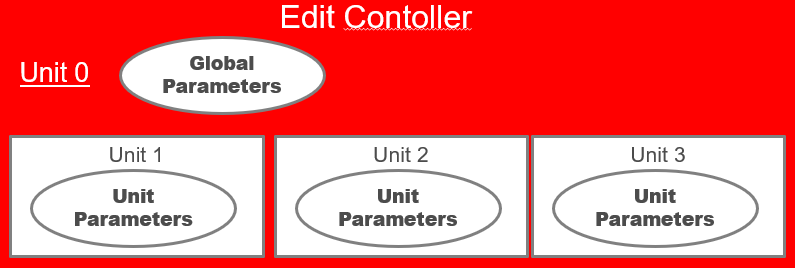
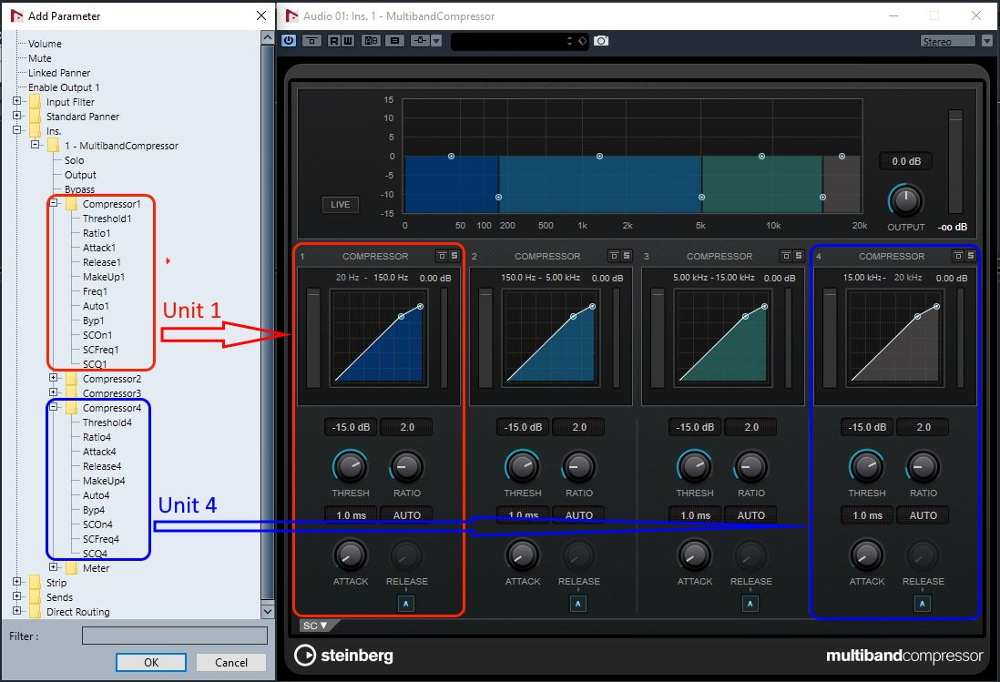
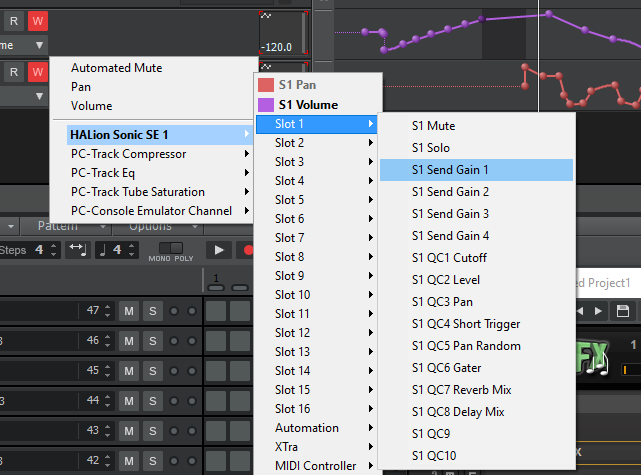

>/ [VST Home](../../Index.md) / [Technical Documentation](../Index.md)
>
># VST 3 Units

**On this page:**

[[_TOC_]]

**Related pages:**

- [Presets & Program Lists](../Presets+Program+Lists/Index.md)
- [Complex Plug-in Structures / Multi-timbral Instruments](../Complex+Structures/Index.md)

---

A unit is a logical section of the plug-in.

## Introduction

For example, an EQ section can be a unit.
The purposes of units are:

- Reveal the internal logical structure of the plug-in
- Organize parameters by associating them with units
- Support program lists
- Support handling of [Complex Plug-in Structures / Multi-timbral Instruments](../Complex+Structures/Index.md)
    - Multiple program lists (associated with a unit)
    - Access to program list data
    - Associations of MIDI tracks and units
    - Synchronization of plug-in GUI and host GUI

## Unit details

- The plug-in can define any number and any kind of units. The semantics of a unit is not important.

- Units are organized in a hierarchical way. Each unit can contain sub-units.

- The root unit of this hierarchy is always present (explicit or implicit) and has ID '**0**'. A plug-in that does not define any further units simply consist of unit '**0**'.

- The plug-in has to assign a unique ID to each further unit it defines and must provide a suitable name for it to be shown in the GUI ([Steinberg::Vst::UnitInfo](https://steinbergmedia.github.io/vst3_doc/vstinterfaces/classSteinberg_1_1Vst_1_1IUnitInfo.html)).

- Each unit can 'contain' parameters. All parameters of the plug-in are managed and published by the [Steinberg::Vst::IEditController](https://steinbergmedia.github.io/vst3_doc/vstinterfaces/classSteinberg_1_1Vst_1_1IEditController.html), but each parameter can be associated with a unit. ([Steinberg::Vst::ParameterInfo::unitId](https://steinbergmedia.github.io/vst3_doc/vstinterfaces/structSteinberg_1_1Vst_1_1ParameterInfo.html#a4d2e0574df0f6d36f26fae1ad759a14f)). A host can organize the list of parameters in a tree view reflecting the unit hierarchy as nodes.

- Each unit can be associated with a program list. (See [Complex Plug-in Structures / Multi-timbral Instruments](../Complex+Structures/Index.md))

- A unit can be associated with specific busses. There can be any kind of combination, but the VST 3 interfaces only define queries for special situations. (See [Units and Tracks]() **<- Link?**)

Most things of interest in regard to units are GUI related, so the access interface [Steinberg::Vst::IUnitInfo](https://steinbergmedia.github.io/vst3_doc/vstinterfaces/classSteinberg_1_1Vst_1_1IUnitInfo.html) needs to be implemented as extension of the edit controller.

See also [Steinberg::Vst::IUnitInfo](https://steinbergmedia.github.io/vst3_doc/vstinterfaces/classSteinberg_1_1Vst_1_1IUnitInfo.html), [Presets & Program Lists](../Presets+Program+Lists/Index.md)

## Examples

- Example of a plug-in (MultibandCompressor from **Cubase** pluginset) with structured parameters list that can be used by the host, here in **Cubase** for selecting a parameter to automate:

    

- Example of a plug-in (VST Amp Rack from **Cubase** pluginset) with structured parameters list visualized in the Parameters tab of the [**PluginTestHost**](../../What+is+the+VST+3+SDK/Plug-in+Test+Host.md) application:

    

- Example of using the unit structure of **HALion Sonic SE** inside **Cakewalk** for automation selection:

    