>/ ... / [VST 3 Workflow Diagrams](../Workflow+Diagrams/Index.md)
>
># Audio Processor Call Sequence

**Related pages:**

- [Edit Controller Call Sequence](../Workflow+Diagrams/Edit+Controller+Call+Sequence.md)

---

```mermaid
stateDiagram

State0: Factory
State1: Created
State2: Initialized
State25: Connected (optional)
State3: Setup Done
State4: Activated
State5: Processing


State1: IComponent->setIoMode
State1: IComponent->getControllerClassID   

State2: IComponent->setState
State2: IComponent->getState
State2: ----------------------------------------------
State2: IConnectionPoint->connect
State2: ----------------------------------------------
State2: IAudioProcessor->setBusArrangement
State2: IAudioProcessor->getBusArrangement
State2: IAudioProcessor->canProcessSampleSize

State25: IComponent->setState
State25: IComponent->getState
State25: ----------------------------------------------
State25: IConnectionPoint->disconnect
State25: IConnectionPoint->notify
State25: ----------------------------------------------
State25: IAudioProcessor->setBusArrangement
State25: IAudioProcessor->getBusArrangement
State25: IAudioProcessor->canProcessSampleSize

State3: IComponent->getBusCount
State3: IComponent->getBusInfo
State3: IComponent->getRoutingInfo
State3: IComponent->activateBus
State3: IComponent->setState
State3: IComponent->getState
State3: ----------------------------------------------
State3: IConnectionPoint->connect
State3: IConnectionPoint->disconnect
State3: IConnectionPoint->notify
State3: ----------------------------------------------
State3: IAudioProcessor->getLatencySamples
State3: IAudioProcessor->getTailSamples
State3: IAudioProcessor->setBusArrangement
State3: IAudioProcessor->getBusArrangement
State3: IAudioProcessor->canProcessSampleSize
State3: IAudioProcessor->setupProcessing
State3: ----------------------------------------------
State3: IProcessContextRequirements->getProcessContextRequirements

State4: IComponent->getBusCount
State4: IComponent->getBusInfo
State4: IComponent->getRoutingInfo
State4: IComponent->setState
State4: IComponent->getState
State4: ----------------------------------------------
State4: IConnectionPoint->notify
State4: ----------------------------------------------
State4: IAudioProcessor->getLatencySamples
State4: IAudioProcessor->getTailSamples
State4: IAudioProcessor->getBusArrangement
State4: IAudioProcessor->canProcessSampleSize
State4: ----------------------------------------------
State4: IAudioPresentationLatency->setAudioPresentationLatency

State5: ---[Processing Thread]-------------------------------
State5: IAudioProcessor->process
State5: ---[UI Thread]---------------------------------------
State5: IComponent->getBusCount
State5: IComponent->getBusInfo
State5: IComponent->getRoutingInfo
State5: IComponent->setState
State5: IComponent->getState
State5: ---[UI Thread]---------------------------------------
State5: IConnectionPoint->notify
State5: ---[UI Thread]---------------------------------------
State5: IAudioProcessor->getLatencySamples
State5: IAudioProcessor->getTailSamples
State5: IAudioProcessor->getBusArrangement
State5: IAudioProcessor->canProcessSampleSize

State0 --> State1: createInstance
State1 --> State0: release
State1 --> State2: initialize
State2 --> State25: connect
State25 --> State2: disconnect
State2 --> State1: terminate
State2 --> State3: setupProcessing
State25 --> State3: setupProcessing
State3 --> State1: terminate
State3 --> State4: setActive(true)
State4 --> State3: setActive(false)
State4 --> State5: setProcessing(true)
State5 --> State4: setProcessing(false)
```



```admonish warning
Note about IAudioProcessor->setProcessing
- transition between Activated and Processing state
- may be called from real-time Processing Thread (must be lock-free and without memory allocation!)
- plug-in has to reset its inner processing state (for example to clean its delay buffers in order to have a defined state when the processing starts again).
```