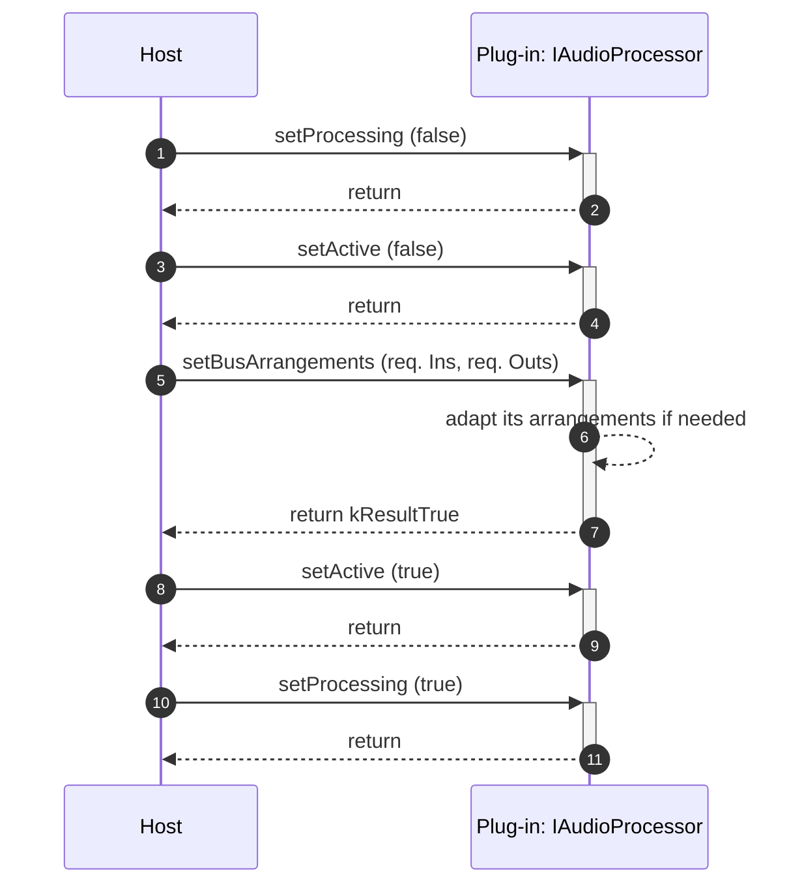
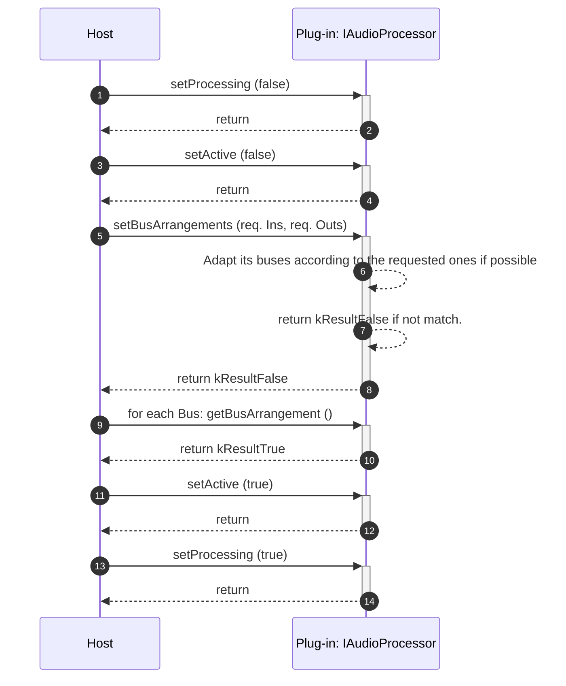

>/ ... / [VST 3 Workflow Diagrams](../Workflow+Diagrams/Index.md)
>
># Bus Arrangement Setting Sequence

**On this page:**

[[_TOC_]]

---

## Plug-In does accepts what the host wants as Bus Arrangements

## Plug-In does not accept what the host wants as Bus Arrangements

## [Check FAQ for some use case!](/pages/FAQ/Processing.md#q-how-are-speaker-arrangement-settings-handled-for-fx-plug-ins)