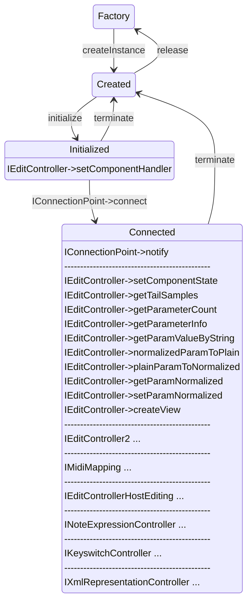

>/ ... / [VST 3 Workflow Diagrams](../Workflow+Diagrams/Index.md)
>
># Edit Controller Call Sequence

**Related pages:**

- [Audio Processor Call Sequence](../Workflow+Diagrams/Audio+Processor+Call+Sequence.md)

---


```admonish info
Note: All Edit Controller methods must be called from the UI Thread
```
