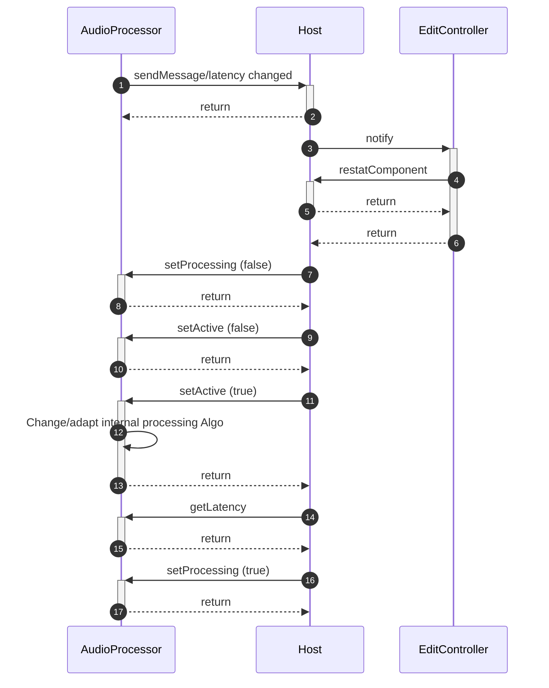
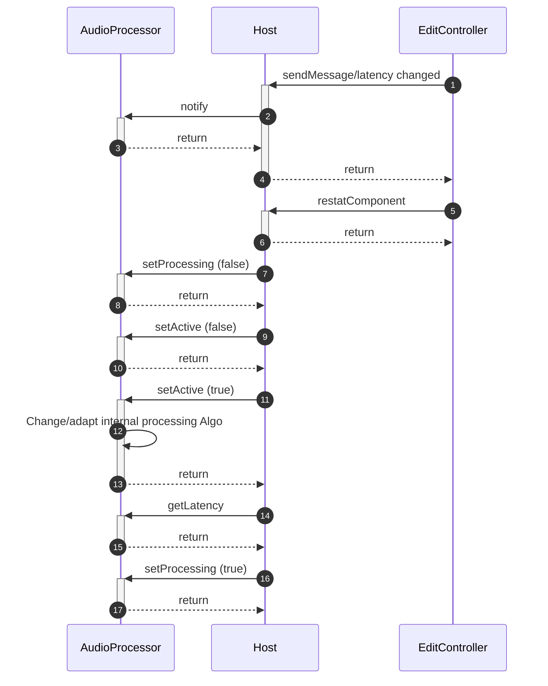
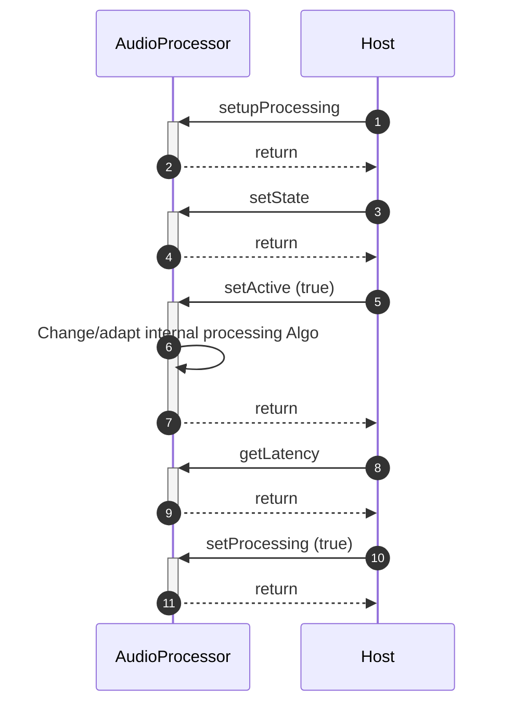

>/ ... / [VST 3 Workflow Diagrams](Index.md)
>
># Get Latency Call Sequence

**On this page:**

[[_TOC_]]

---

## Initiated from AudioProcessor

## Initiated from EditController/UI

## without EditController

