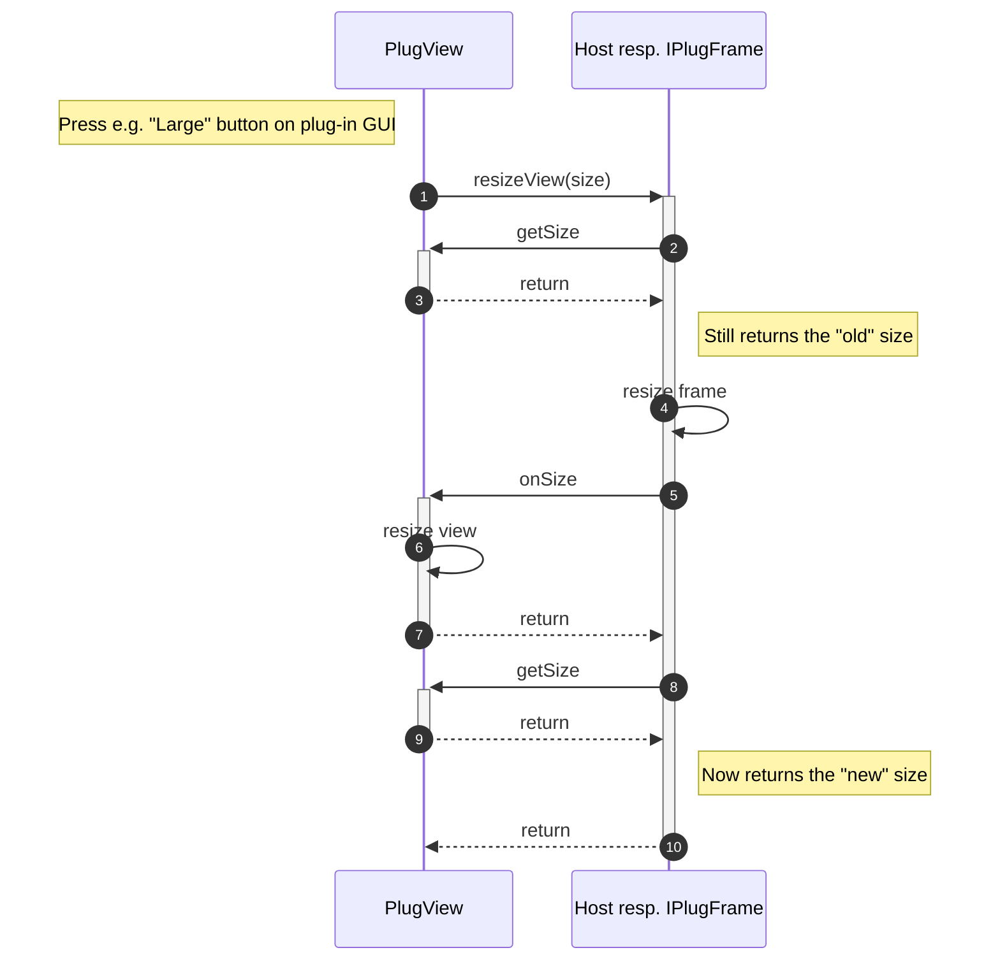
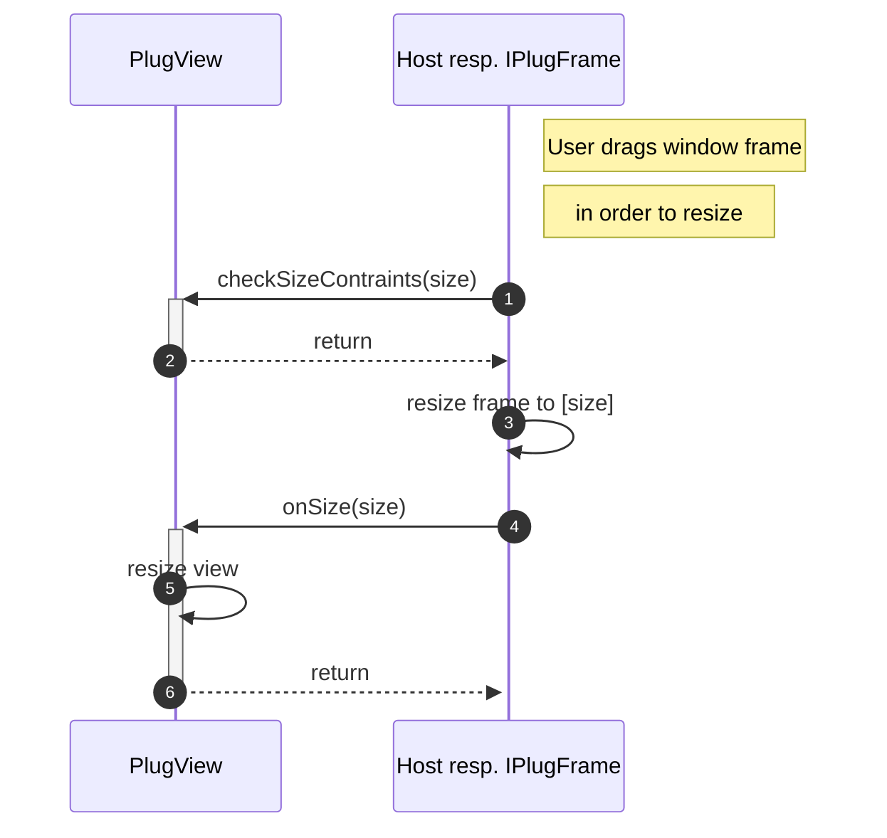
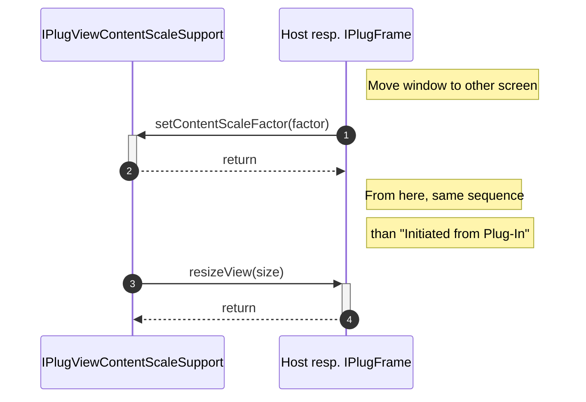

>/ ... / [VST 3 Workflow Diagrams](../Workflow+Diagrams/Index.md)
>
># Resize View Call Sequence

**On this page:**

[[_TOC_]]

---

## Initiated from Plug-In

## Initiated from Host

**User drags window frame in order to resize**

**Moving window to other screen**

