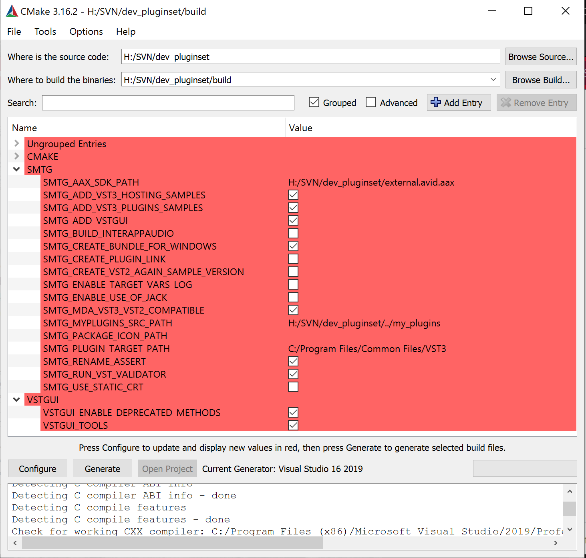
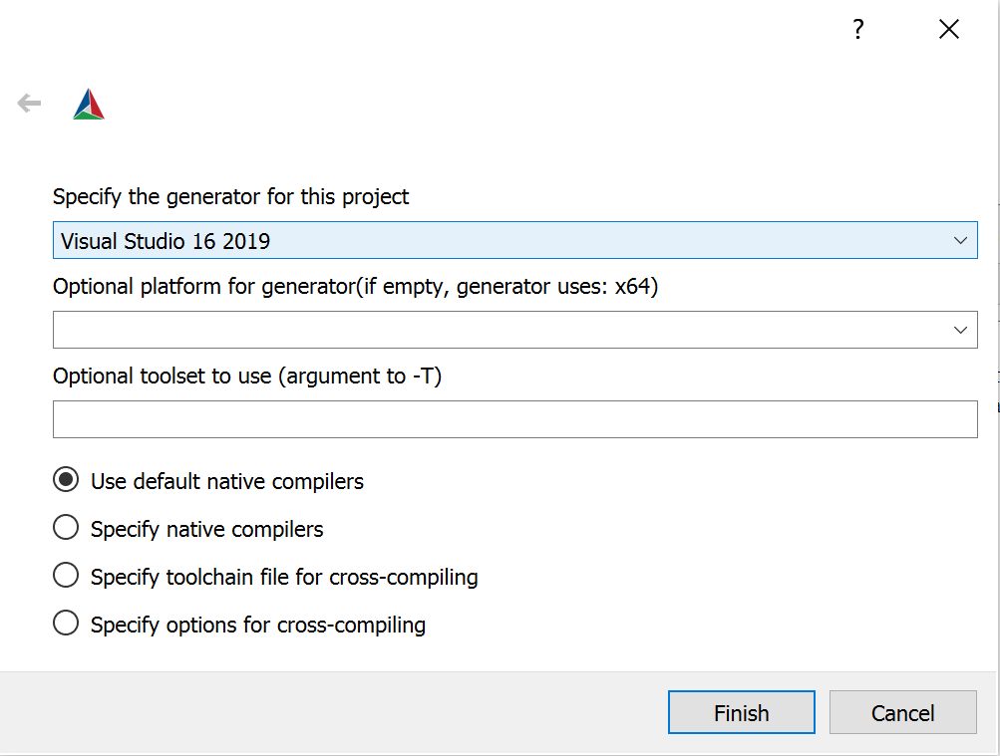

>/ [VST Home](../index.md) / [Tutorials](../Tutorials/Index.md)
>
># Building the examples included in the SDK

**On this page:**

[[_TOC_]]

---

This tutorial explains how to set up your computer and create an environment for compiling the **VST 3** audio plug-in examples provided with the **VST 3 SDK**. These include plug-ins like simple DSP effects (Gain, compressor, delay, ...), synths instruments and some plug-ins showing how to handle some specific **VST 3** features (Note Expression, Program Change, channel info context, ...).

They can be loaded into **VST 3** hosts like Cubase, WaveLab, ...

---

## Part 1: Getting and installing the VST 3 SDK

For downloading the SDK, see this section "[How to set up my system for VST 3](../Getting+Started/How+to+setup+my+system.md)".

Download cmake from: <https://cmake.org/download/> or use a package manager for your OS.

---

## Part 2: Building the examples

### Building the examples on Windows

- Create a folder for the build and move to this folder (using cd):

``` c++
mkdir build
cd build
```

- Generate the solution/projects: specify the path to the project where CMakeLists.txt is located:

``` c++
cmake.exe -G "Visual Studio 16 2019" -A x64 ../vst3sdk
or without symbolic links
cmake.exe -G "Visual Studio 16 2019" -A x64 ../vst3sdk-DSMTG_CREATE_PLUGIN_LINK=0
```

>**Preparation on Windows**
>
>---
>
>Generated VST 3 Microsoft Visual Studio Projects using the [cmake](https://cmake.org/) included in the SDK will create by default symbolic links for each built plug-in in the [official VST 3 folder](../Technical+Documentation/Locations+Format/Plugin+Locations.md), in order to allow this on Windows you have to adapt the Group Policy of Windows. See [Here](../Getting+Started/Preparation+on+Windows.md)!
>
>If you do not want to create this link, call [cmake](https://cmake.org/) with this parameter:
>
>``` c++
>-DSMTG_CREATE_PLUGIN_LINK=0
>```
>
>You could choose the [new user location](../Technical+Documentation/Locations+Format/Plugin+Locations.md) for VST 3 plug-ins, call [cmake](https://cmake.org/) with this parameter:
>
>``` c++
>-DSMTG_PLUGIN_TARGET_USER_PROGRAM_FILES_COMMON=1
>```

>ⓘ **Note**\
>You can find the string definition for different Visual Studio Generators in the cmake online documentation (<https://cmake.org/documentation/>)

- Build the plug-in (you can use Visual Studio too):

``` c++
msbuild.exe vstsdk.sln
(or alternatively for example for release)

cmake --build . --config Release
```

### Building the examples on macOS

- Create a folder for the build and move to this folder (using cd):

``` c++
mkdir build
cd build
```

- Generate the solution/projects: specify the path to the project where CMakeLists.txt is located:\
For XCode:

``` c++
cmake -GXcode ../vst3sdk
```

Without XCode (here debug variant):

``` c++
cmake -DCMAKE_BUILD_TYPE=Debug ../
```

- Build the plug-in (you can use XCode too):

``` c++
xcodebuild
(or alternatively for example for release)

cmake --build . --config Release
```

### Building the examples on Linux

- Install the required packages: [Required packages](../Getting+Started/How+to+setup+my+system.html#package-requirements)
- Create a folder for the build and move to this folder (using cd):

``` c++
mkdir build
cd build
```

- Generate the solution/projects: specify the path to the project where CMakeLists.txt is located:

``` c++
cmake ../vst3sdk
```

- Build the plug-in:

``` c++
make
(or alternatively for example for release)

cmake --build . --config Release
```

### Building using cmake-gui

- Start the cmake-gui application which is part of the cmake installation (<https://cmake.org/download/>)



- "***Browse Source...***": select the folder VST3_SDK
- "***Browse Build...***": select a folder where the outputs (projects/...) will be created. Typically a folder named "build"
- You can check the ***SMTG** Options*
- Press "***Configure***" and choose the generator in the window that opens: for example "**Visual Studio 16 2019**"



- Press "***Generate***" to create the project
- Open your targeted IDE, and compile the solution/project.
