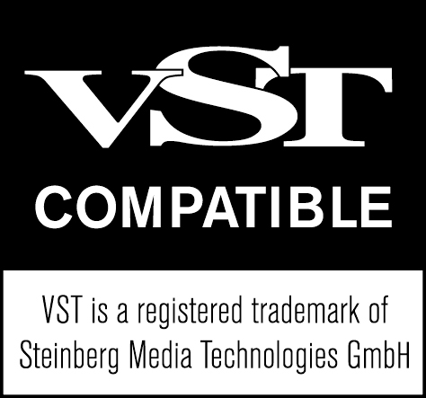
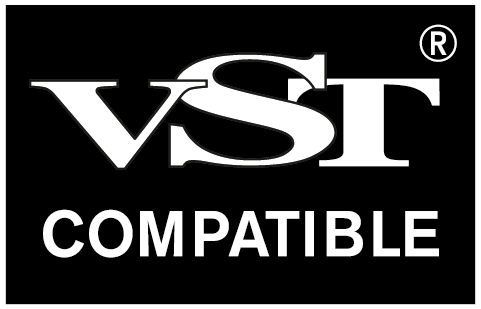
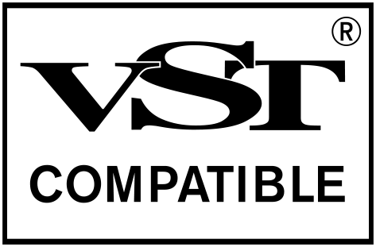

>/ [VST Home](../) / [VST 3 Licensing](Index.md)
>
># Steinberg VST usage guidelines

**On this page:**

[[_TOC_]]

**Related pages:**

- [VST 3 Licensing](Index.md)
- [What are the licensing options for VST 3?](VST3+License.md)
- [Frequently Asked Questions: Licensing](../FAQ/Licensing.md)

---

Trademark usage (e.g. "VST" name or logo) is optional under [MIT license](https://tlo.mit.edu/understand-ip/exploring-mit-open-source-license-comprehensive-guide), but if used, must comply with Steinberg's official trademark rules. 

Included in the **VST 3 SDK**, the **VST compatible Logo** can be found in the folder *VST_SDK/VST3_SDK/vst3_doc/artwork*.

## 1. Use of VST Compatible logo

If you choose to display the **VST Compatible Logo** or refer to the **VST** trademark, you are required to include a reference to Steinberg by using the “**VST Compatible logo**” as provided by Steinberg on each of the following:

### a) Packaging:
The **VST Compatible Logo** must appear clearly on all physical product packaging.

### b) Websites:
The **VST Compatible Logo** must be visible on every web page referencing or promoting a product using or created with the **VST** SDK. Displaying the **VST Compatible Logo** only in a site-wide footer or imprint is not sufficient.

### c) Documentation (including but not limited to PDF manuals, printed manuals, online help):
The **VST Compatible Logo** must be included in all forms of product documentation. If space constraints prohibit inclusion, a copyright attribution referencing Steinberg must be clearly included.

### d) Advertising Materials:
The **VST Compatible Logo** must be shown in all promotional and advertising content unless spatial constraints apply, in which case the attribution must be provided.

### e) Product UI (“About Box” or equivalent):
The **VST Compatible Logo** should appear in the About Box or equivalent UI element (e.g., help menu or splash screen). If space is insufficient, the attribution notice must be used.

## 2. Use of "VST" Without the VST Compatible Logo

Parties using the **VST** 3 SDK in accordance with its license are permitted to use the term “**VST**” in standard font to denote compatibility, subject to full compliance with these guidelines. This use is allowed:
  - On product packaging
  - On websites
  - In product names

In all cases, the **VST Compatible Logo** must appear in relevant context, adjacent to or associated with the use of the term “**VST**”.

## 3. Claiming of compatibility

Statements such as “compatible with 64-bit **VST**” are permitted under the following conditions:
  - The product is in fact compatible and was developed using the **VST** 3 SDK.
  - The **VST Compatible Logo** is shown near the claim, on the same page or surface.

## 4. Use on websites

The **VST Compatible Logo** must appear on every webpage referencing a product that uses or was created with the SDK or that displays the term "**VST**". Placement in the imprint or a single page is not sufficient.

## 5. Use on Packaging

The **VST Compatible Logo** must be printed on the packaging of any product that uses or was created using the VST SDK.

## 6. Use in Product Names or Logos

You may refer to **VST** compatibility in a product name if:
  - “**VST**” is used in plain text, e.g., “MyCoolEngine for VST”.
  - The **VST Compatible Logo** is shown in immediate visual proximity.
  - “**VST**” is not graphically stylized, embedded into the **VST Compatible Logo**, or merged into the core product brand.

| Allowed       | Not allowed                   |
| :-            | :-                            | 
|| |

## 7. Use in Company Names
Use of the term “**VST**” in a company name is strictly prohibited.

## 8. Use in social media
“**VST**” may be included in social media handles, channel names, or URLs if:
  - The reference denotes compatibility (e.g., “MyCoolEngineForVST”).
  - The **VST Compatible Logo** is shown clearly and consistently on the channel/page.

## 9. Use in Domain Names
Use of “**VST**” in domain names (e.g., MyCoolEngineForVST.com) is permitted if:
  - The name includes a reference to compatibility (not a standalone brand).
  - All web pages under the domain:
    - Use the SDK.
    - Display the **VST Compatible Logo**. 

## 10. Use in Logos
  - Including “**VST**” in company logos is not allowed.
  - Use in product logos is allowed only in compliance with Section 6.

## 11. Use in video
“**VST**” may appear in:
  - Video titles (e.g., tutorials or demonstrations)
  - On-screen references

Only if the **VST Compatible Logo** is:
  - Displayed in the video itself
  - Displayed on the webpage where the video is hosted or previewed

If a still frame from the video includes the term “**VST**”, the **VST Compatible Logo** must also be present in the frame or immediately adjacent context.

## 12. Use in Categories or URLs
Use of “**VST**” in URLs or category names (e.g., www.myreviews.com/VSTplugins/) is allowed if:
  - The category is descriptive and generic.
  - Only products that use or are created using the **VST** 3 SDK are listed.

## 13. Combinations or Variants
It is not permitted to create modified terms or compositions such as “VSTi” or other abbreviations, blends, or derivatives.

## 14. Official VST Compatible Logos
Steinberg provides the following **VST Compatible Logos**:

>
>

Minimum printing size = 20 x 18,7 mm

>
>

Minimum printing size = 15 x 10 mm

These dimensions must be respected in all digital and printed uses.

## 15. Trademark Attribution Requirements
The first use of “**VST**” in any product-related material must include the ® symbol.
Additionally, the following attribution must appear in all product credits and documentation: 

>"**VST is a trademark of Steinberg Media Technologies GmbH, registered in Europe and other countries.**"

## 16. Questions and Contact
For further clarification or to submit suggestions, please contact:\
[reception@steinberg.de](mailto:reception@steinberg.de)
