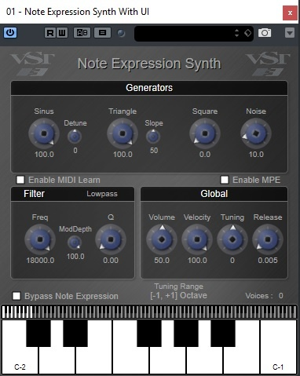
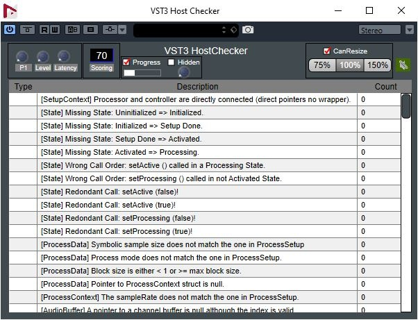
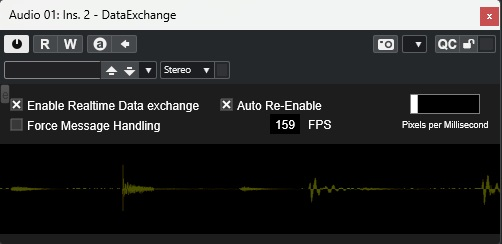

>/ [VST Home](../) / [What is the VST 3 SDK?](Index.md)
>
># VST 3 Plug-in Examples

**On this page:**

[[_TOC_]]

**Related pages:**

- [VST 3 Plug-in Test Host](Plug-in+Test+Host.md)
- [AAX, AUv3, AU and VST 2 Wrappers](Wrappers/Index.md)
- [Building the examples included in the SDK on Windows](../Tutorials/Building+the+examples/Building+the+examples+included+in+the+SDK+Windows.md)
- [Building the examples included in the SDK on macOS](../Tutorials/Building+the+examples/Building+the+examples+included+in+the+SDK+macOS.md)
- [Building the examples included in the SDK on Linux](../Tutorials/Building+the+examples/Building+the+examples+included+in+the+SDK+Linux.md)
---

## Introduction

The SDK includes some Plug-ins implementation examples. The Legendary **AGain** and **ADelay**, thanks Paul Kellet the Open-source **mda** Plug-ins, a basic "Note Expression Synth" supporting "**Note Expression Event**", an example of **pitchnames** support Plug-in, a **VST 3 Host Checker** which checks if a host is **VST 3** compliant and more...

>
>
>
>
>
>
>

Check the folder *"public.sdk/samples/vst"* of the SDK!

>ⓘ **Note**\
>They use cmake as project generator: [Using cmake for building VST 3 plug-ins](../Tutorials/Using+cmake+for+building+plug-ins.md)\
>In order to add your own Plug-ins check: [Generate a new plug-in with the Project Generator App](../Tutorials/Generate+new+plug-in+with+Project+Generator.md)

## ADelay

Very simple delay plug-in:

- only one parameter (a delay)

Check the folder *"public.sdk/samples/vst/adelay"* of the SDK!

Classes:

- ADelayProcessor
- ADelayController

## AGain

The SDK includes an AGain plug-in which is a very simple **VST 3** plug-in. This plug-in:

- is multichannel compatible
- supports bypass processing
- has an automated gain parameter
- has an Event input bus (allowing to use noteOn velocity to control the gain factor)
- has a VU peak meter
- uses the [**VSTGUI4**](VSTGUI.md) library
- a version of this plug-in with side-chaining is available (showing a plug-in using the same controller and different - components)
- an **AAX** version is available
- a **AUv3** version is available

Check the folder *"public.sdk/samples/vst/again"* of the SDK!

Classes:

- AGain
- AGainWithSideChain (used for side-chain version)
- AGainController

## AGain Sample Accurate

Simple plug-in showing how to achieve sample-accurate processing.

Based Check the folder *"public.sdk/samples/vst/again_sampleaccurate"* of the SDK!

## TestChannelContext

Very simple plug-in:

- showing how to use the [Steinberg::Vst::ChannelContext::IInfoListener](../Technical+Documentation/Change+History/3.6.5/IInfoListener.md) interface
- using a generic UI

Check the folder *"public.sdk/samples/vst/channelcontext"* of the SDK!

## DataExchange

This plug-in:

- shows how to exchange data (waveform) between processor (in the realtime thread) and controller using the VST Data Exchange API: [Vst::IDataExchangeHandler](../Technical+Documentation/Data+Exchange/Index.md)
- shows how easy it is to use [**VSTGUI**](VSTGUI.md)

Check the folder *"public.sdk/samples/vst/dataexchange"* of the SDK!

## HostChecker

- Instrument, Panner and Fx plug-in checking the **VST 3** support of a host
- It uses [**VSTGUI**](VSTGUI.md)
- an **AAX** version is available

Check the folder *"public.sdk/samples/vst/hostchecker"* of the SDK!

## TestLegacyMIDICCOut

Very simple plug-in:

- showing how to use [LegacyMIDICCOutEvent](../Technical+Documentation/Change+History/3.6.12/LegacyMIDICCOutEvent.md) which allow to generate MIDI CC as output event
- VST parameters change which creates [LegacyMIDICCOutEvent](../Technical+Documentation/Change+History/3.6.12/LegacyMIDICCOutEvent.md) Event

Check the folder *"public.sdk/samples/vst/legacymidiccout"* of the SDK!

Classes:

- LegacyMIDICCOut::Plug

## mda plug-ins

- Effects (stereo to stereo plug-ins):
  - **Ambience**: Reverb.
  - **Bandisto**: Multi-band Distortion.
  - **BeatBox**: Drum Replacer.
  - **Combo**: Amp and Speaker Simulator.
  - **DeEsser**: High frequency Dynamics Processor.
  - **Degrade**: Sample quality reduction.
  - **Delay**: Simple stereo delay with feedback tone control.
  - **Detune**: Simple up/down pitch shifting thickener.
  - **Dither**: Range of dither types including noise shaping.
  - **DubDelay**: Delay with feedback saturation and time/pitch modulation.
  - **Dynamics**: Compressor / Limiter / Gate.
  - **Image**: Stereo image adjustment and M-S matrix.
  - **Leslie**: Rotary speaker simulator.
  - **Limiter**: Opto-electronic style limiter.
  - **Loudness**: Equal loudness contours for bass EQ and mix correction.
  - **MultiBand**: Multi-band compressor with M-S processing modes.
  - **Overdrive**: Soft distortion.
  - **RePsycho!**: Drum loop pitch changer.
  - **RezFilter**: Resonant filter with LFO and envelope follower.
  - **RingMod**: Simple Ring Modulator.
  - **Round Panner**: 3D panner.
  - **Shepard**: Continuously rising/falling tone generator.
  - **SpecMeter**: Stereo 13 Bands spectral Meter.
  - **Splitter**: Frequency / level crossover for setting up dynamic processing.
  - **Stereo Simulator**: Haas delay and comb filtering.
  - **Sub-Bass Synthesizer**: Several low frequency enhancement methods.
  - **TalkBox**: High resolution vocoder.
  - **TestTone**: Signal generator with pink and white noise, impulses and sweeps.
  - **Thru-Zero Flanger**: Classic tape-flanging simulation.
  - **Tracker**: Pitch tracking oscillator, or pitch tracking EQ
- Instruments (1 Event input, 1 stereo Audio output):
  - **DX10**: Sounds similar to the later Yamaha DX synths including the heavy bass but with a warmer, cleaner tone.
  - **EPiano**: Simple EPiano.
  - **JX10**: The plug-in is designed for high quality (lower aliasing than most soft synths) and low processor usage.
  - **Piano**: Not designed to be the best sounding piano in the world, but boasts extremely low CPU and memory usage.

Based on the OpenSource *mda plug-ins* (<http://mda.smartelectronix.com/>), this set of plug-ins demonstrates how wrap DS- code in a **VST 3** plug-in.

Check the folder *"public.sdk/samples/vst/mda-vst3"* of the SDK!

Classes:

- BaseProcessor
- BaseController
- BaseParameter

## Note Expression Synth

- Instrument plug-in supporting [note expression](../Technical+Documentation/Change+History/3.5.0/INoteExpressionController.md) events
- It shows how easy it is to use [**VSTGUI**](VSTGUI.md)
- a **AUv3** version is available

Check the folder *"public.sdk/samples/vst/note_expression_synth"* of the SDK!

Classes:

- NoteExpressionSynth::Processor
- NoteExpressionSynth::Controller
- NoteExpressionSynth::Voice

## Note Expression Text

- Plug-in visualizing the NoteExpression as Text
- It shows how easy it is to use [**VSTGUI4**](VSTGUI.md)

Check the folder *"public.sdk/samples/vst/note_expression_text"* of the SDK!

## Panner

- Simple Panner plug-in showing how to support Panner category (mono to Stereo)
- It shows how easy it is to use [**VSTGUI**](VSTGUI.md)

Check the folder *"public.sdk/samples/vst/panner"* of the SDK!

Classes:

- PlugController
- PlugProcessor

## PitchNames

- Instrument plug-in showing PitchNames support
- It shows how easy it is to use [**VSTGUI**](VSTGUI.md)

Check the folder *"public.sdk/samples/vst/pitchnames"* of the SDK!

Classes:

- PitchNamesController
- PitchNamesProcessor
- PitchNamesDataBrowserSource

## Test Prefetchable Support

Very simple plug-in:
- showing how to use the [Steinberg::Vst::IPrefetchableSupport](../Technical+Documentation/Change+History/3.6.5/IPrefetchableSupport.md) interface
- using a generic UI

Check the folder *"public.sdk/samples/vst/prefetchablesupport"* of the SDK!

## Test Multiple Program Changes

Very simple plug-in:

- showing how to support multiple ProgramChange parameters: 16 slots with one associated program change parameter and a program list for each slot.
- using a generic UI

## Test Program Change

Very simple plug-in:

- showing how to support Program List
- using a generic UI

## Sync Delay

Very simple delay plug-in:

- showing how to support [IProcessContextRequirements](../Technical+Documentation/Change+History/3.7.0/IProcessContextRequirements.md)

Check the folder *"public.sdk/samples/vst/syncdelay"* of the SDK!

## UTF16Name

Very simple plug-in:

- with UTF16 characters in plug-in and company name

Check the folder *"public.sdk/samples/vst/utf16name"* of the SDK!
