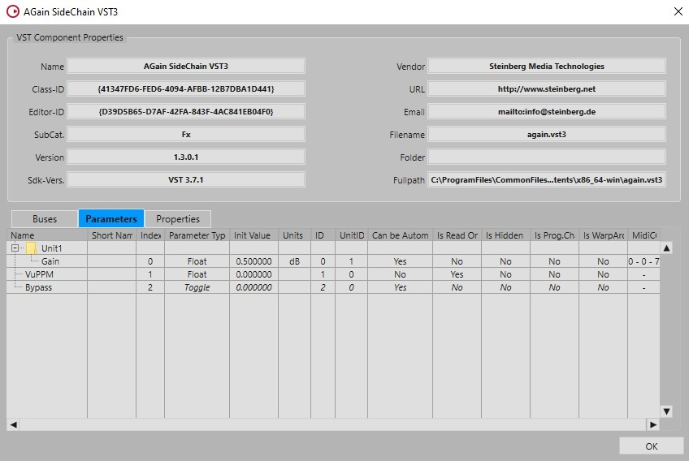
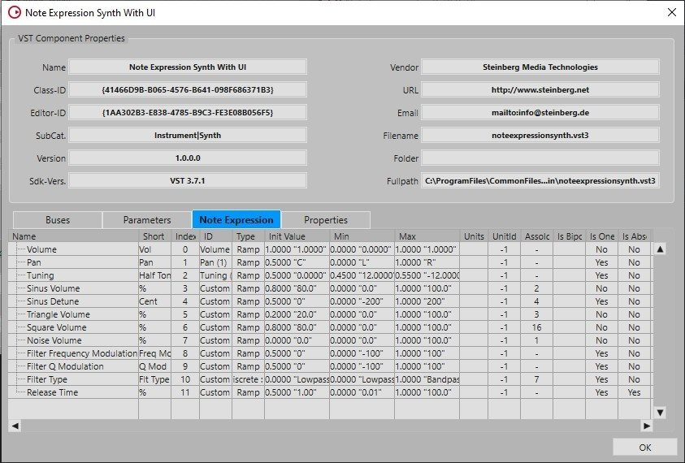
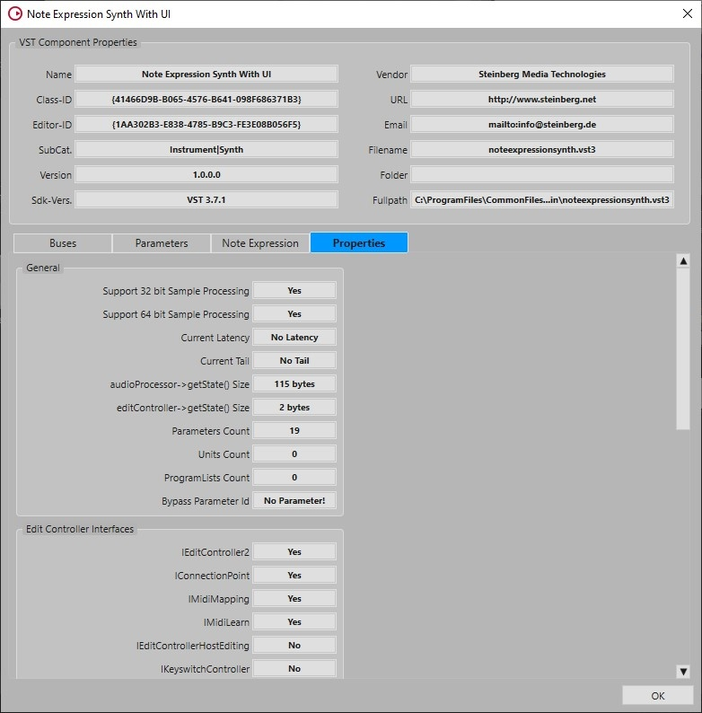
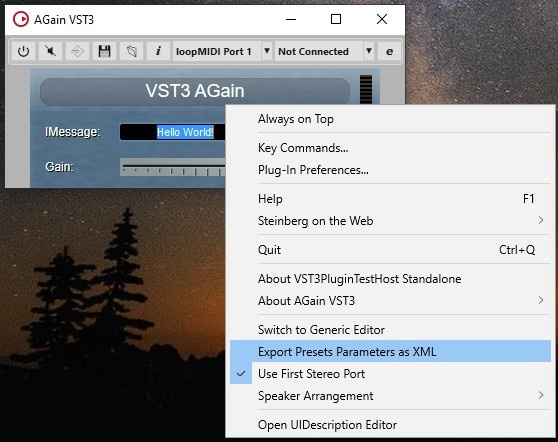
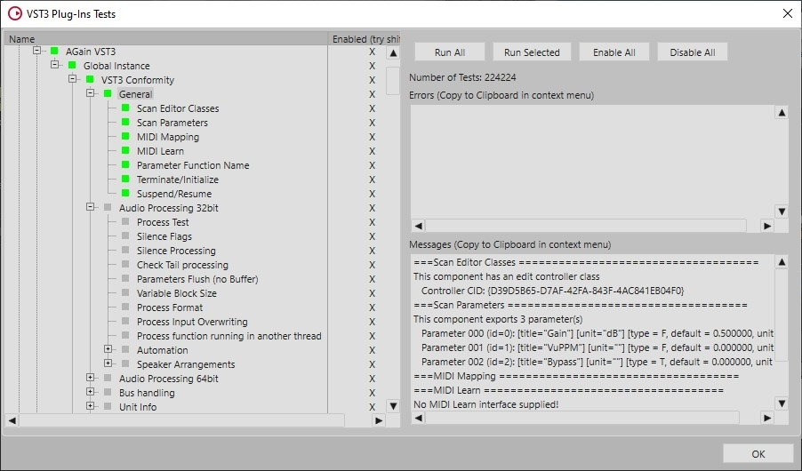
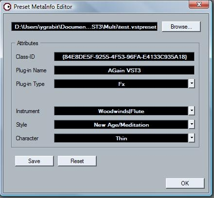

>/ [VST Home](../) / [What is the VST SDK?](Index.md)
>
># VST 3 Plug-in Test Host

**On this page:**

[[_TOC_]]

**Related pages:**

- [VST 3 Plug-in Examples](Plug-in+Examples.md)

---

## Introduction

The SDK provides a test application called **VST3PluginTestHost** for Apple macOS X (Apple Silicon/Intel x86_64) and Microsoft Windows (x64 and Arm64EC).

This application allows you to load a plug-in, simulates some inputs (Audio and Event) and acts like a small **VST 3** host application based on an **ASIO** driver.

Included in this application is a test module which allows you to check your plug-in in regard to the **VST 3** standard.

Check the folder *"bin"* of the SDK!

## How to use it?

### Command Line

You could start **VST3PluginTestHost** with some options in the command line:

 - Speficy a folder where the app should scan **VST 3** Plug-ins:
    - --pluginfolder "Folder to scan for plug-ins"
    - for examples: 
      - *VST3PluginTestHost.exe --pluginfolder "C:\Development\VST3"*
 - Rendering *MIDI* files into audio files for the first loaded instrument (samplerate and blocksize (size of audio block in samples) are optionals; if not provided, the current settings of the ASIO is used):
    - --audioexport "MIDI Folder location" "Audio Output Folder" \[samplerate\] \[blocksize\]
    - for examples: 
      - *VST3PluginTestHost.exe --audioexport "C:\Content\MIDI" "C:\Content\Audio Output"*
      - *VST3PluginTestHost.exe --audioexport "C:\Content\MIDI" "C:\Content\Audio Output" 48000 128*

### Menu Description

#### File

- **File => Load Preset...**: Loads a VST 3 Preset for the first loaded plug-in (first slot).
- **File => Save Preset...**: Saves a VST 3 Preset for the first loaded plug-in.
---
- **File => Load MIDI File...**: Loads a MIDI file which could be played by using the transport section. All loaded plug-ins will receive the MIDI events. MIDI program change messages are also sent when a file is loaded.
- **File => Unload MIDI File**: Unloads the currently loaded MIDI file.
---
- **File => Export Audio...**: Allows you to select a folder containing MIDI files, loads each file, and exports the audio renderings of the first loaded plug-in.
- **File => Export Audio for current loaded MIDI...**: Uses the currently loaded MIDI file to export the audio renderings of the first loaded plug-in.
---
- **File => Convert VST 3 Presets to VST 2 Presets**: Converts **VST 3** Presets to compatible **VST 2** Presets (fxp or fxb).
- **File => Overwrite Plug-in Name in VST 3 Presets...**: Renames the plug-in name in a set of **VST 3** Presets.
---
- **File => Rescan blocklisted VST 3 Plug-in**: Forces a rescan of plug-ins that were previously blocklisted.

#### Edit

- **Edit => Key Commands...**: Opens the Key Commands window.
- **Edit => Global Preferences...**: Opens the Global Preferences window, where you can change settings such as the ASIO driver.
- **Edit => Plug-In Preferences...**: Opens the Plug-In Preferences window, where you can configure Inputs/Outputs routing, for example.

#### View

- **View => Open Plug-in Information Window**: Opens a window displaying all registered **VST 3** plug-in components and controllers.
- **View => Open Plug-in Unit Tests Window**: Opens a window where you can run a series of unit tests on your plug-in.
- **View => Open Preset Editor**: Opens the **VST 3** preset editor, allowing you to view, inspect, and modify presets, including adding metadata attributes such as *Instrument*, *Style*, or *Character*.

#### Transport

 - Typical Transport actions.

#### Help

- Some useful links for developing **VST 3** Plug-ins.

---

#### Dark Mode version

 - Selectable in the **Edit => Global Preferences...** window.

## VST Player Window

### Audio Input

In this section you can select the audio source of your plug-in for the *Main Input Audio Bus* and for the *Aux Input Audio Bus* ([Side-chain](../Technical+Documentation/Change+History/3.0.0/Multiple+Dynamic+IO.html#what-is-a-side-chain): if available) between:

- A sine wave
- Noise
- Silence
- ASIO Input (first stereo)
- An Audio File (in this case use the browser (... button) to choose the file (wave, aiff))

A Volume slider allows you to control the level of the source.

### Event Input

This section simulates note events sent to the plug-in.

- A pattern could be defined and initialized with randomized, chromatic or manual events. (for Chromatic choose the start note in the pattern and select Chromatic in the pop-up menu).
- Active check box: enable/disable the playback of this pattern.
- You can choose different loop stepping for this pattern (1, 1/2, ...1/32)
- If you have already loaded a MIDI file, choose "No Pattern" to play this MIDI file.

### VST Rack

This section allows you to load serialized multiple plug-ins. Each plug-in will be loaded in a slot.

- To load a plug-in (Audio or Instrument) click on the associated pop-up menu and select one plug-in.
- To unload a plug-in, click on its associated X button on its slot.

For each loaded plug-in in a slot you can:

- Enable/disable the plug-in with the **On** button.
- Bypass/process the plug-in with the **Byp** button (if available as parameter).
- Enable/disable the [Side-chain](../Technical+Documentation/Change+History/3.0.0/Multiple+Dynamic+IO.html#what-is-a-side-chain) bus with the **Aux** button (available only if the plug-in has input [Side-chain](../Technical+Documentation/Change+History/3.0.0/Multiple+Dynamic+IO.html#what-is-a-side-chain)).
- Open its editor with the **Edit** button. A second **Edit** button allows to open a second editor (useful for checking if the used GUI Framework of the plug-in allows this!).
- Save a Preset with the **Store** button.
- Load a Preset with the **Load** button.
- Open the information page of this plug-in with the **Info** button (see below).

### Info Window

- Information window of AGain plug-in showing the **Parameters** panel:

- Information window of NoteExpressionSynth plug-in showing the **[Note Expression](../Technical+Documentation/Change+History/3.5.0/INoteExpressionController.md)** panel:

- Information window of AGain plug-in showing the **Properties** panel:

### Context Menu

Right click on the opened plug-in opens a context menu which allows to trigger some actions:

- **Switch to Generic Editor**: open the generic editor instead of the one provided by the plug-in.
- **Export Presets Parameters as XML**: load automatically all available VST 3 Presets for this plug-in and create a readable XML file for each preset including the parameter states.

### Transport

In this section you can:

 - Set the gain of the output audio
 - Toggle time format between Time and Bars
 - See the current time Display
 - Control the transport state (Start/Stop/Rewind/Loop)
   - Click Play to start playback of the MIDI file/Pattern.
   - Click Stop to pause the MIDI file/Pattern at the current position.
   - Click the button twice to reset the song position to the start.
   - Activate Loop to play the entire MIDI file in a loop.
 - See which MIDI file is currently loaded when hover over the info icon
 - Change the song position
   - The song position indicator shows the position of the transport cursor. Above the song position indicator, the position is displayed as a number.
   - To move the transport cursor, drag the song position indicator to a new position.
 - Change tempo and signature
   - Tempo: 
     - Set this parameter to Track to follow the original tempo of the MIDI file.
With the Adjust Tempo parameter, you can scale the playback relatively to the original tempo of the MIDI file.
     - Set this parameter to Fixed to enter the tempo manually.
   - Time Signature:
     - Determines the time signature. You can enter a new time signature in fractions of beats.

## VST 3 Plug-ins Tests Window

In this window you can select a specific test branch for a specific plug-in. You can navigate in the test tree (left part), then click on the button **Run Selected** to process only the selected tests.

There are 2 kinds of tests concerning the way the plug-in is instantiated:

- Global Instance: only one instance of the plug-in will be instantiated for all tests.
- Local Instances: for each test a new instance of the plug-in will be instantiated.

We define currently 2 sets of test:

- VST 3 Conformity
- Special Features

You can run all available tests with **Run All**. It is possible also to disable some tests with the check box in the left view.

Error reports will be displayed in the **Errors view**. In the **Messages View** some warnings (or some plug-in limitations), test results and progress are displayed.

In this version of this **Plug-in Test Host**, the tests are limited to the main **VST 3** features, in future version the test coverage will be extended.

## Preset Editor

With this editor you can load and modify **VST 3** presets created with the **Store** button of the VST Rack by adding some meta-attributes.

