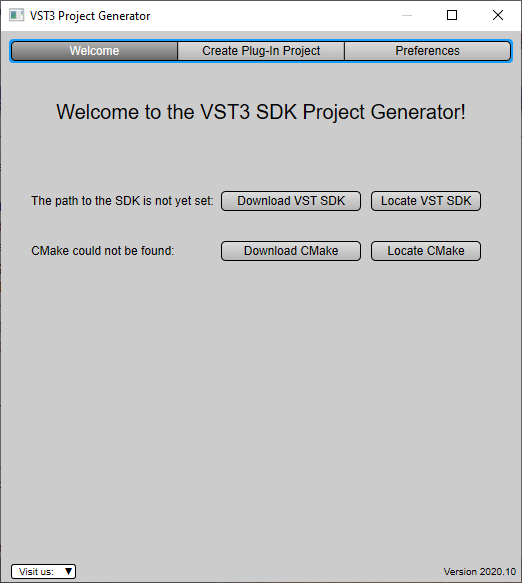
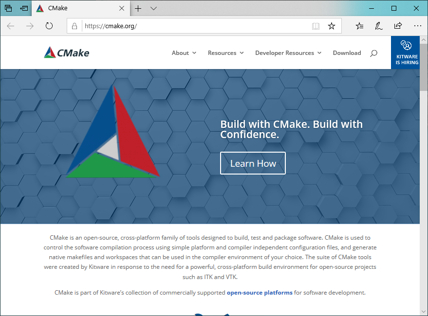

>/ [VST Home](../index.md) / [What is the VST 3 SDK?](../What+is+the+VST+3+SDK/Index.md)
>
># VST 3 Project Generator

**On this page:**

[[_TOC_]]

**Related pages:**

- [Generate a new plug-in with Project Generator](../Tutorials/Generate+new+plug-in+with+Project+Generator.md)

---

## Introduction

This open source application (Win/macOS) allows you to generate easily a new **VST 3** plug-in project by just entering in a GUI some parameters.


Check the folder *"VST3_Project_Generator"* of the SDK!

The source code is available at [GitHub - steinbergmedia/vst3projectgenerator: VST3 Project Generator](https://github.com/steinbergmedia/vst3projectgenerator).

## Start the VST 3 Project Generator Application



The first time you start the application, you will ask to define 2 folders where are located the **VST SDK** and the **CMake** tool. It still possible to change these folders afterward in the *Preferences* Tab, see [Setting the Preferences](#setting-the-preferences).

The ***Visit us***: menu includes some useful links.

### Locate CMake

If you have already downloaded the **CMake** tool, you just have to indicate the *Project Generator* where it is located, for this click on **Locate CMake** and choose with the file selector the *cmake.exe* file:


If you do not have previously installed the **CMake** tool, you could download it, just click on ***Download CMake***, an internet browser will open the dedicated **CMake** webpage, check the Download section and install **CMake**.



### Locate VST SDK

If you have already downloaded the **VST SDK**, you just have to indicate the *Project Generator* where it is located, for this click on ***Locate VST SDK*** and choose with the folder selector the *VST3_SDK* folder:


If you do not have previously installed the **VST SDK**, you could download it, just click on ***Download VST SDK***, a dialog appears:


You have 2 possibilities to download the **VST 3 SDK**:

- **Commercial**: by clicking on it you will be redirect to the latest available SDK version to download, including all tools (check [What is the VST 3 SDK?](../What+is+the+VST+3+SDK/Index.md)), with this variant of the SDK you are able to create and commercialize your plug-ins (See [What are the licensing options for VST 3?](../VST+3+Licensing/What+are+the+licensing+options.md)).
- **Open Source**: by clicking on it you will be redirect to Steinberg **Github** where you will be able to clone the **VST 3 SDK**, this variant does not included all available tools (See [What are the licensing options for VST 3?](../VST+3+Licensing/What+are+the+licensing+options.md)).

### VST SDK and cmake successfully located

As soon as the requested 2 locations are founded, the user interface of the application should like this:


The next time you start the *Project Generator* application you will not asked to relocate them!

## Setting the Preferences

Before creating any plug-in project, you have to define some global preferences which will be automatically saved when closing the application.

Company Information

The information included in this subsection will be used for generating Factory information associated to all plug-ins you will generate. This will be read by the host application loading your plug-ins and the host may display it to an user.

- **Vendor**: this is your Company name: e.g. *"Steinberg Media Technologies GmbH"*
- **E-Mail**: your email, which could be used by the host to redirect an user to your support for example: e.g. *"<support@steinberg.net>"*
- **URL**: the URL of your Company: e.g. *"<https://www.steinberg.net>"*
- **C++ Namespace**: this allows you to predefine a namespace which will be used to surround your plug-in source code: e.g. *"MyWantedNamespace"*:
```
//...
namespace MyWantedNamespace {

/-----------------------------------------------------------------------
MyPluginController::MyPluginController ()
{
//...
}
} // end namespace
//...
namespace MyWantedNamespace {
```

### Path Preferences

Like mentioned above in the subsection Path Preferences you could change several locations:

- **VST3 SDK Path**: the current used **VST 3 SDK** you have previously downloaded.
- **CMake Executable Path**: the current used **CMake** tool

## Setting and creating a plug-in project

In this tab you are defining some information for the creation of a new plug-in:


- **Name**: the name of the plug-in which is displayed in a host: e.g. *"AGain"*
- **Type**: this specifies the main **VST 3** Sub-Category ([PlugType](https://steinbergmedia.github.io/vst3_doc/vstinterfaces/group__plugType.html)) of your plug-in:
    - **Audio Effect**: ([kFx](https://steinbergmedia.github.io/vst3_doc/vstinterfaces/group__plugType.html#ga0411b97bcc13d604e738a28aee43bb61)) a simple audio effect Stereo→Stereo
    - **Instrument**: ([kInstrument](https://steinbergmedia.github.io/vst3_doc/vstinterfaces/group__plugType.html#ga93cb7a7100ac96cfafceb6216770c42dl#gabe030351fd22d14dad35c817e1849f59)) a simple instrument with 1 Event input and 1 stereo Audio output
- **Use VSTGUI**: check this if you want to use [**VSTGUI**](../What+is+the+VST+3+SDK/VSTGUI.md) as UI framework
- **macOS Deployment Target**: enter here the minimum requested macOS version targeted
- **C++ Class Name**: this specifies the basename of your plug-in classes: e.g. *"AGain"*
```
class AGainProcessor : public AudioEffect
{
    //...
};

class AGainController : public EditControllerEx1
{
    //...
};
```
- **Bundle ID**: this is the ID needed for example for the Info.plist of macOS: e.g. *"com.steinberg.again"*
- **Filename Prefix**: (optional) this will be added as file prefix to the created files: e.g. *"AGain"* => AGainProcessor.cpp / AGainController.h / ...
- **Output Directory**: you define here in which folder your project will be created
- **CMake Generator**: CMake tool required to define a generator in order to create configuration files for a specific build system: there are 2 kinds of generators: Command-Line and IDE. Choose the one you need for example:
    - on Windows: **Visual Studio 16 2019**
    - on macOS: **Xcode**
- **CMake Platform**: you could here define which target platform should be used, i.e x64 or ARM64

Once all information is setup, you could click on **Create**, a script will created and **CMake** will be used and the chosen IDE will be opened. In the bottom area the script output is displayed, you have the possibility to copy it by using the dedicated button: **Copy Script Output To Clipboard**.


**Example of script Output**

```
C:\Program Files\CMake\bin\CMake.exe   C:\Users\YGrabit\Desktop\SDKs\VST3_SDKs\3.7.  2\VST_SDK\VST3_Project_Generator\Windows\Resources\GenerateVS3Plugi   n.cmake
-DSMTG_VST3_SDK_SOURCE_DIR_CLI="C:/Users/YGrabit/DesktopSDKs/  VST3_SDKs/3.7.2/VST_SDK/VST3_SDK"
-DSMTG_GENERATOR_OUTPUT_DIRECTORY_CLI="C:/Users/YGrabitDesktop/    SDKs/VST3_SDKs/3.7.2/VST_SDK"
-DSMTG_PLUGIN_NAME_CLI="AGain"-DSMTG_PLUGIN_CATEGORY_CLI="Fx" -DSMTG_CMAKE_PROJECT_NAME_CLI="AGain"
-DSMTG_PLUGIN_BUNDLE_NAME_CLI="AGain"  -DSMTG_PLUGIN_IDENTIFIER_CLI="com.steinberg.again"
-DSMTG_MACOS_DEPLOYMENT_TARGET_CLI="10.12" -DSMTG_VENDOR_NAME_CLI="Steinberg Media Technologies"
-DSMTG_VENDOR_HOMEPAGE_CLI="www.steinberg.net" -DSMTG_VENDOR_EMAIL_CLI="info@steinberg.net"
-DSMTG_PREFIX_FOR_FILENAMES_CLI="" -DSMTG_PLUGIN_CLASS_NAME_CLI="AGain"
-DSMTG_ENABLE_VSTGUI_SUPPORT_CLI=ON -P "C:\Users\YGrabit\Desktop\SDKs\VST3_SDKs\3.7.   2\VST_SDK\VST3_Project_Generator\Windows\Resources\GenerateVS3Plugi    n.cmake"
==================================================

 Steinberg Media Technologies GmbH
 VST3 Project Generator

==================================================

-- Found Git: C:/Program Files/Git/cmd/git.exe (found version"2.9. 2.windows.1")
-- SMTG_CMAKE_SCRIPT_DIR           : C:/Users/YGrabit/DesktopSDKs/ VST3_SDKs/3.7.2/VST_SDK/VST3_Project_Generator/WindowsResources
-- SMTG_ENABLE_VSTGUI_SUPPORT      : ON
-- SMTG_GENERATOR_OUTPUT_DIRECTORY : C:/Users/YGrabit/DesktopSDKs/ VST3_SDKs/3.7.2/VST_SDK
-- SMTG_TEMPLATE_FILES_PATH        : C:/Users/YGrabit/DesktopSDKs/ VST3_SDKs/3.7.2/VST_SDK/VST3_Project_Generator/WindowsResources/    cmake/templates
-- SMTG_VST3_SDK_SOURCE_DIR        : C:/Users/YGrabit/DesktopSDKs/ VST3_SDKs/3.7.2/VST_SDK/VST3_SDK

-- SMTG_VENDOR_NAME            : Steinberg Media Technologies
-- SMTG_VENDOR_HOMEPAGE        : www.steinberg.net
-- SMTG_VENDOR_EMAIL           : info@steinberg.net
-- SMTG_SOURCE_COPYRIGHT_HEADER: Copyright(c) 2021 SteinbergMedia  Technologies.
-- SMTG_PLUGIN_NAME            : AGain
-- SMTG_PREFIX_FOR_FILENAMES   : e.g. myplugincontroller.h
-- SMTG_PLUGIN_IDENTIFIER      : com.steinberg.again, used eg. in  Info.plist
-- SMTG_PLUGIN_BUNDLE_NAME     : AGain

-- SMTG_CMAKE_PROJECT_NAME     : e.g. AGain will output AGainvst3
-- SMTG_VENDOR_NAMESPACE       : e.g. namespace MyCompanyName{...}
-- SMTG_PLUGIN_CLASS_NAME      : e.g. class AGainProcessor :public     AudioEffect {...}
-- SMTG_PLUGIN_CATEGORY        : Fx
-- SMTG_MACOS_DEPLOYMENT_TARGET: 10.12

-- SMTG_Processor_UUID         : 0x127C3DBA, 0x64685FC5,   0x93CB28A6, 0x3D757D0D
-- SMTG_Controller_UUID        : 0x9D1EB67B, 0x14815678,   0x898F9FEE, 0xAD51C016

-- Configured: C:/Users/YGrabit/Desktop/SDKs/VST3_SDKs/3.72/   VST_SDK/AGain/CMakeLists.txt
-- Configured: C:/Users/YGrabit/Desktop/SDKs/VST3_SDKs/3.72/   VST_SDK/AGain/resource/Info.plist
-- Copied    : C:/Users/YGrabit/Desktop/SDKs/VST3_SDKs/3.72/   VST_SDK/AGain/resource127C3DBA64685FC593CB28A63D757D0D_snapshot.png
-- Copied    : C:/Users/YGrabit/Desktop/SDKs/VST3_SDKs/3.72/   VST_SDK/AGain/resource127C3DBA64685FC593CB28A63D757D0D_snapshot_2.    0x.png
-- Configured: C:/Users/YGrabit/Desktop/SDKs/VST3_SDKs/3.72/   VST_SDK/AGain/resource/myplugineditor.uidesc
-- Configured: C:/Users/YGrabit/Desktop/SDKs/VST3_SDKs/3.72/   VST_SDK/AGain/resource/win32resource.rc
-- Configured: C:/Users/YGrabit/Desktop/SDKs/VST3_SDKs/3.72/   VST_SDK/AGain/source/version.h
-- Configured: C:/Users/YGrabit/Desktop/SDKs/VST3_SDKs/3.72/   VST_SDK/AGain/source/myplugincids.h
-- Configured: C:/Users/YGrabit/Desktop/SDKs/VST3_SDKs/3.72/   VST_SDK/AGain/source/myplugincontroller.cpp
-- Configured: C:/Users/YGrabit/Desktop/SDKs/VST3_SDKs/3.72/   VST_SDK/AGain/source/myplugincontroller.h
-- Configured: C:/Users/YGrabit/Desktop/SDKs/VST3_SDKs/3.72/   VST_SDK/AGain/source/mypluginentry.cpp
-- Configured: C:/Users/YGrabit/Desktop/SDKs/VST3_SDKs/3.72/   VST_SDK/AGain/source/mypluginprocessor.cpp
-- Configured: C:/Users/YGrabit/Desktop/SDKs/VST3_SDKs/3.72/   VST_SDK/AGain/source/mypluginprocessor.h

C:\Program Files\CMake\bin\CMake.exe -G "Visual Studio 162019" -S  "C:/Users/YGrabit/Desktop/SDKs/VST3_SDKs/3.7.2VST_SDK\AGain" -B     "C:/Users/YGrabit/Desktop/SDKsVST3_SDKs/3.7.2/VST_SDK\AGain\build"     -DSMTG_ADD_VSTGUI=ON
-- Selecting Windows SDK version 10.0.19041.0 to targetWindows 10. 0.19042.
-- The C compiler identification is MSVC 19.28.29913.0
-- The CXX compiler identification is MSVC 19.28.29913.0
-- Detecting C compiler ABI info
-- Detecting C compiler ABI info - done
-- Check for working C compiler: C:/Program Files (x86)Microsoft   Visual Studio/2019/Professional/VC/Tools/MSVC/1428.29910/bin/    Hostx64/x64/cl.exe - skipped
-- Detecting C compile features
-- Detecting C compile features - done
-- Detecting CXX compiler ABI info
-- Detecting CXX compiler ABI info - done
-- Check for working CXX compiler: C:/Program Files (x86)Microsoft     Visual Studio/2019/Professional/VC/Tools/MSVC14.28.29910/bin/  Hostx64/x64/cl.exe - skipped
-- Detecting CXX compile features
-- Detecting CXX compile features - done
-- [SMTG] SMTG_PLUGIN_TARGET_PATH is set to: C:/ProgramFiles/  Common Files/VST3
-- [SMTG] CMAKE_SOURCE_DIR is set to: C:/Users/YGrabitDesktop/SDKs/    VST3_SDKs/3.7.2/VST_SDK/AGain
-- [SMTG] CMAKE_CURRENT_LIST_DIR is set to: C:/UsersYGrabit/   Desktop/SDKs/VST3_SDKs/3.7.2/VST_SDK/VST3_SDK
-- [SMTG] Disable all VST3 samples
-- Could NOT find EXPAT (missing: EXPAT_LIBRARYEXPAT_INCLUDE_DIR)
-- VSTGUI will use the embedded Expat package!
-- [SMTG] SMTG_VSTGUI_ROOT is set to: C:/Users/YGrabitDesktop/SDKs/    VST3_SDKs/3.7.2/VST_SDK/VST3_SDK
-- [SMTG] SMTG_AAX_SDK_PATH is not set. If you need it,please  download the AAX SDK!
-- Looking for C++ include stdatomic.h
-- Looking for C++ include stdatomic.h - not found
-- [SMTG] Setup running validator for AGain
-- Configuring done
-- Generating done
-- Build files have been written to: C:/Users/YGrabit/DesktopSDKs/ VST3_SDKs/3.7.2/VST_SDK/AGain/build
```

That´s it!

You can contribute to this project on <https://github.com/steinbergmedia/vst3projectgenerator!>

## VST3ProjectGenerator License

```
BSD style

VST3ProjectGenerator LICENSE
(c) Steinberg Media Technologies, All Rights Reserved

Redistribution and use in source and binary forms, with orwithout  modification,
are permitted provided that the following conditions are met:

* Redistributions of source code must retain the abovecopyright    notice,
this list of conditions and the following disclaimer.
* Redistributions in binary form must reproduce the abovecopyright     notice,
this list of conditions and the following disclaimer inthe     documentation
and/or other materials provided with the distribution.
* Neither the name of the Steinberg Media Technologies northe  names of its
contributors may be used to endorse or promote productsderived     from this
software without specific prior written permission.

THIS SOFTWARE IS PROVIDED BY THE COPYRIGHT HOLDERS ANDCONTRIBUTORS     "AS IS" AND
ANY EXPRESS OR IMPLIED WARRANTIES, INCLUDING, BUT NOT LIMITEDTO,   THE IMPLIED
WARRANTIES OF MERCHANTABILITY AND FITNESS FOR A PARTICULARPURPOSE  ARE DISCLAIMED.
IN NO EVENT SHALL THE COPYRIGHT OWNER OR CONTRIBUTORS BELIABLE FOR     ANY DIRECT,
INDIRECT, INCIDENTAL, SPECIAL, EXEMPLARY, OR CONSEQUENTIALDAMAGES  (INCLUDING,
BUT NOT LIMITED TO, PROCUREMENT OF SUBSTITUTE GOODS ORSERVICES;    LOSS OF USE,
DATA, OR PROFITS; OR BUSINESS INTERRUPTION) HOWEVER CAUSEDAND ON   ANY THEORY OF
LIABILITY, WHETHER IN CONTRACT, STRICT LIABILITY, OR TORT  (INCLUDING NEGLIGENCE
OR OTHERWISE) ARISING IN ANY WAY OUT OF THE USE OF THISSOFTWARE,   EVEN IF ADVISED
OF THE POSSIBILITY OF SUCH DAMAGE.
```
