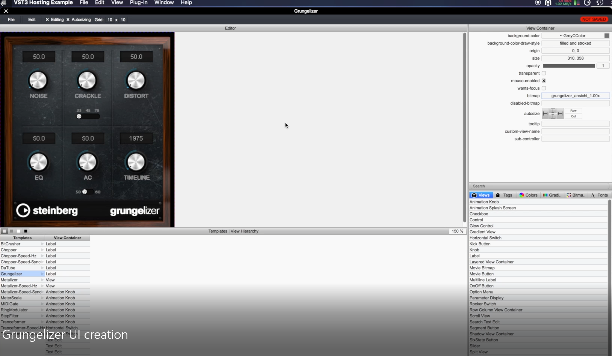
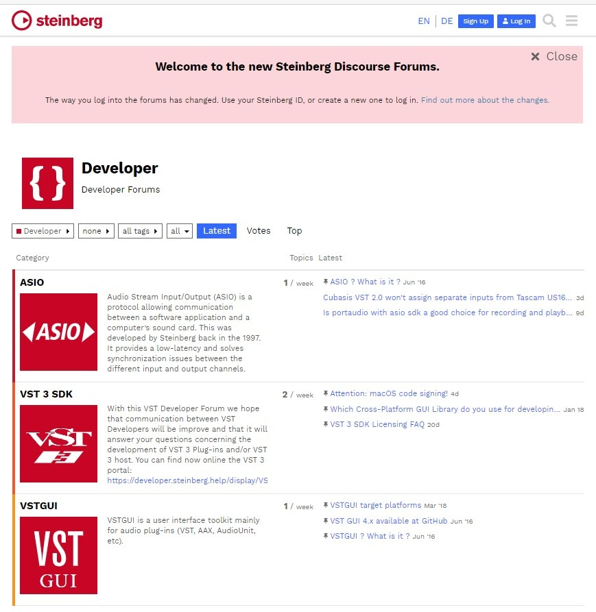
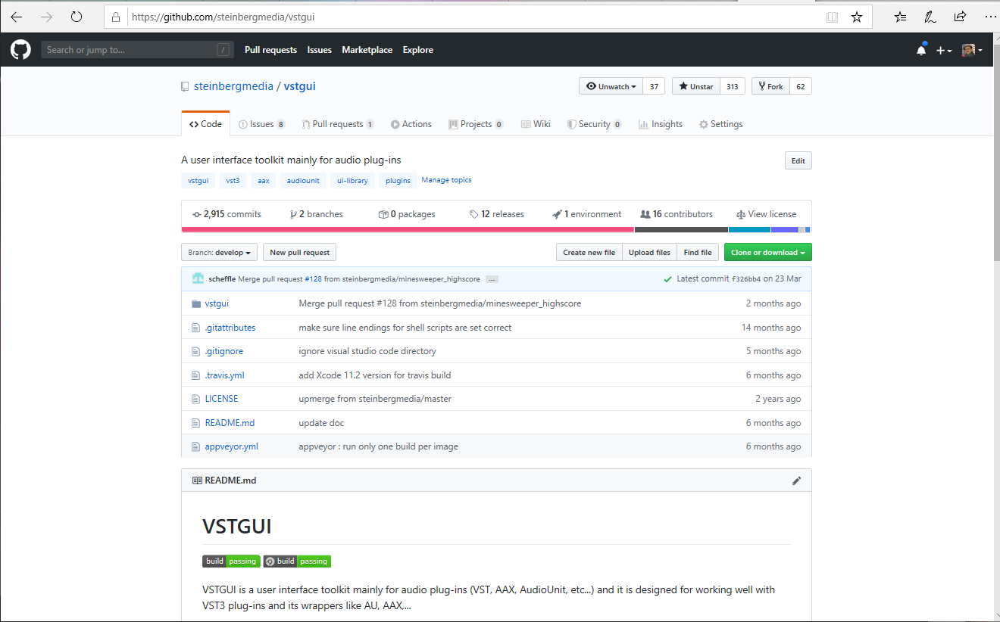

>/ [VST Home](../) / [What is the VST 3 SDK?](Index.md)
>
># VSTGUI

**On this page:**

[[_TOC_]]

**Related pages:**

- <https://sdk.steinberg.net>

---

## Introduction

This is a user interface toolkit mainly for audio plug-ins (VST, AudioUnit, etc). Based on the XML definition of the plug-in UI, **VSTGUI** includes an embedded editor (UIDescription Editor) which allows the developer to create a plug-in UI just by drag & drop of the UI element.

First developed in-house by Steinberg Media Technologies (around 1998) for their first VST plug-ins. Later added as binary libraries to the official **VST SDK**. Since May 2003, **VSTGUI** is open source, and is hosted now at GitHub <https://github.com/steinbergmedia/vstgui>.

The last official release version of **VSTGUI** is always included in the **VST 3 SDK**.



Example of the **VSTGUI** UIDescription Editor (embedded editing WYSIWYG)

Check the folder "*vstgui4"* of the SDK!

## VSTGUI Forum

Visit Steinberg's **VST Developer Forum** in order to get help with development, submit bug reports, request new features and connect to other VSTGUI developers:



**<https://sdk.steinberg.net>**

## VSTGUI on GitHub



**<https://github.com/steinbergmedia/vstgui>**

## VSTGUI License

```
BSD style

VSTGUI LICENSE
(c) Steinberg Media Technologies, All Rights Reserved

Redistribution and use in source and binary forms, with or without modification,
are permitted provided that the following conditions are met:

* Redistributions of source code must retain the abovecopyright notice,
this list of conditions and the following disclaimer.
* Redistributions in binary form must reproduce the above copyright notice,
this list of conditions and the following disclaimer inthe documentation
and/or other materials provided with the distribution.
* Neither the name of the Steinberg Media Technologies northe names of its
contributors may be used to endorse or promote productsderived from this
software without specific prior written permission.

THIS SOFTWARE IS PROVIDED BY THE COPYRIGHT HOLDERS AND CONTRIBUTORS "AS IS" AND
ANY EXPRESS OR IMPLIED WARRANTIES, INCLUDING, BUT NOT LIMITEDTO, THE IMPLIED
WARRANTIES OF MERCHANTABILITY AND FITNESS FOR A PARTICULAR PURPOSE ARE DISCLAIMED.
IN NO EVENT SHALL THE COPYRIGHT OWNER OR CONTRIBUTORS BELIABLE FOR ANY DIRECT,
INDIRECT, INCIDENTAL, SPECIAL, EXEMPLARY, OR CONSEQUENTIAL DAMAGES (INCLUDING,
BUT NOT LIMITED TO, PROCUREMENT OF SUBSTITUTE GOODS ORSERVICES; LOSS OF USE,
DATA, OR PROFITS; OR BUSINESS INTERRUPTION) HOWEVER CAUSEDAND ON ANY THEORY OF
LIABILITY, WHETHER IN CONTRACT, STRICT LIABILITY, OR TORT (INCLUDING NEGLIGENCE
OR OTHERWISE) ARISING IN ANY WAY OUT OF THE USE OF THISSOFTWARE, EVEN IF ADVISED
OF THE POSSIBILITY OF SUCH DAMAGE.
```

## [Tutorials for VSTGUI](../Tutorials/Use+VSTGUI+to+design+a+UI.md)

**[Use VSTGUI to design a User Interface](../Tutorials/Use+VSTGUI+to+design+a+UI.md)**

This tutorial explains how to use **VSTGUI**. **VSTGUI** comes with a *WYSIWYG* editor that allows you to createstunning user interfaces for your plug-in.
